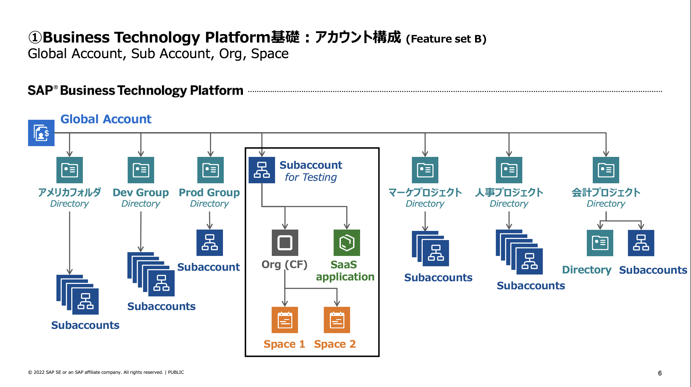

# 0. 環境管理者セットアップ

## 本マニュアルのステップの全体像
1. SAP BTP 全体像の解説
2. SAP Ariba API 情報の取得

### 1. SAP BTP 全体像の解説

#### SAP BTPアカウントの内部構造

SAP BTP は以下の要素から構成されています。 

> [!NOTE]
> 今回は、「BTP Enablement - Spend Management」サブアカウントの「development」スペースに入って開発を行います。

|   項目   |         内容                            |
| -------------- |--------------------------       |
| Global Account    |    BTPの契約単位      |
| Subaccount | テナントの単位であり、データアクセスや可視化の単位として利用する。BTPサービスの有効化もこの単位で行う。1:1で連携する概念として、Orgが存在する。|
| Org | Cloud Foundry の概念であり、BTPのサブアカウントと1:1で相当する |
| Space | 実際のアプリケーション開発やデプロイを行う最小単位。例えば DEVスペース、QAスペース、PRODスペース というような使い方も可能 |

## 次のステップ

[1. 開発環境のセットアップ](../01_開発環境のセットアップ/README.md)

### 各ステップ リンク一覧
[1. 開発環境のセットアップ](../01_開発環境のセットアップ/README.md)  
[2. バックエンドアプリの構築](../02_バックエンドアプリの構築/README.md)  
[3. フロントエンドアプリの構築](../03_フロントエンドアプリの構築/README.md)  
[4. デプロイと結果の確認](../04_デプロイと結果の確認/README.md)  