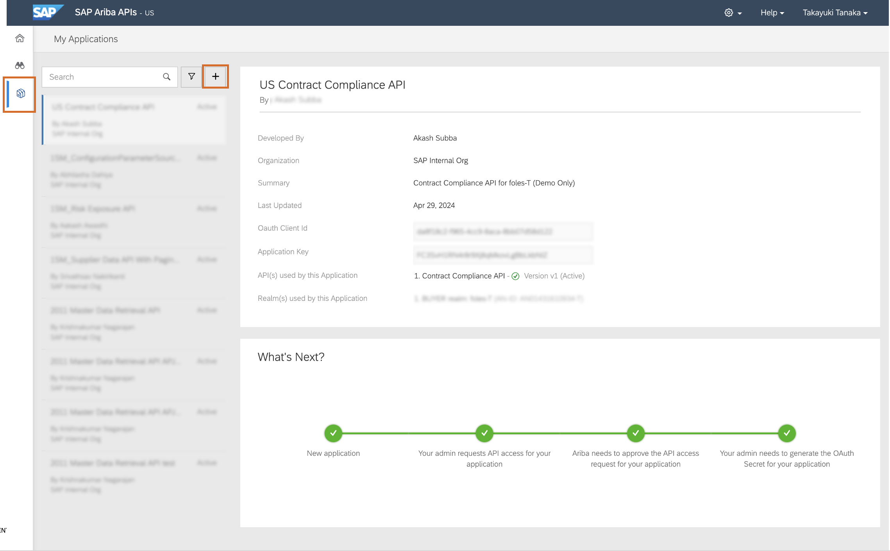
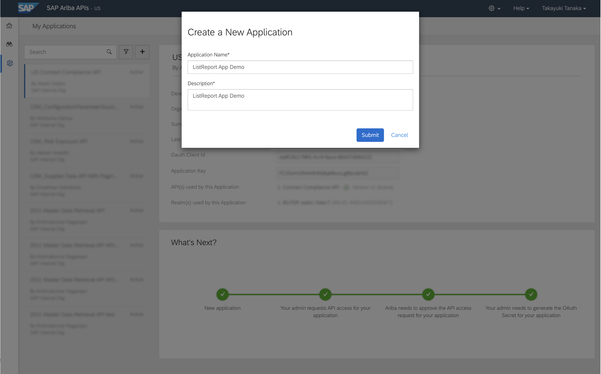
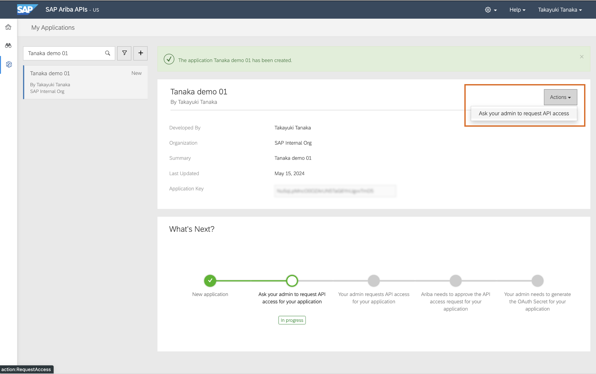
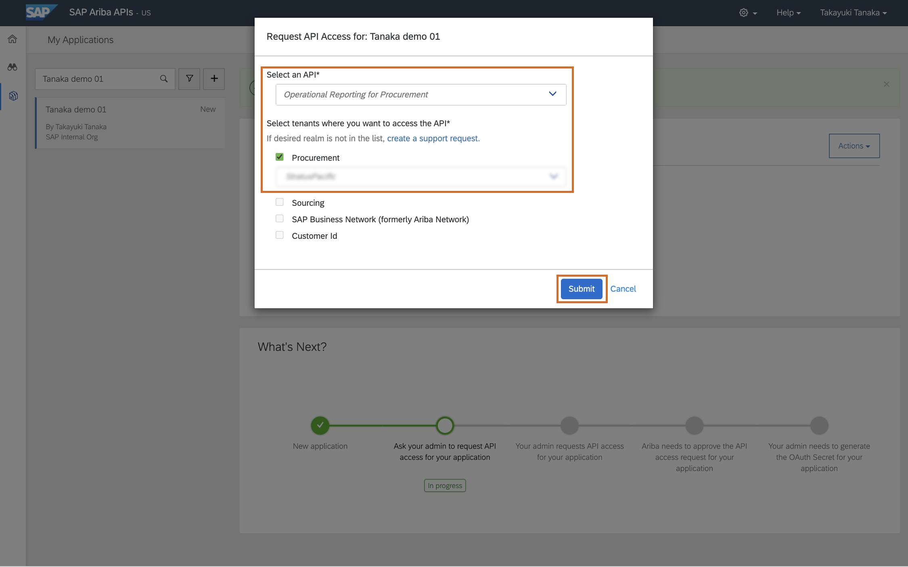

# 0. 環境管理者セットアップ

## 本マニュアルのステップの全体像
1. SAP BTP 全体像の解説
2. SAP Ariba API 情報の取得

### 1. SAP BTP 全体像の解説

#### SAP BTPアカウントの内部構造

SAP BTP は以下の要素から構成されています。 

|   項目   |         内容                            |
| -------------- |--------------------------       |
| Global Account    |    BTPの契約単位      |
| Subaccount | テナントの単位であり、データアクセスや可視化の単位として利用する。BTPサービスの有効化もこの単位で行う。1:1で連携する概念として、Orgが存在する。|
| Org | Cloud Foundry の概念であり、BTPのサブアカウントと1:1で相当する |
| Space | 実際のアプリケーション開発やデプロイを行う最小単位。例えば DEVスペース、QAスペース、PRODスペース というような使い方も可能 |

> [!NOTE]
> 今回は、「BTP Enablement - Spend Management」サブアカウントの「development」スペースに入って開発を行います。

### 2. SAP Ariba API 情報の取得

1. SAP Ariba の API を利用するためには、まず下記 SAP Ariba APIs Portal より、申請が必要です。 
申請を行い承認を得ると、APIを呼び出す際に必要なAPIキーと認証情報を入手できます。 

[SAP Ariba APIs Portal](https://developer.ariba.com/)

2. 左側のペインから「Discover」を選択すると、SAP Aribaに用意されたAPIの一覧を閲覧できます。 
ここで、エンドポイントや送付するべきリクエストの形式、また返答されるはずのレスポンススキーマの確認等が可能です。 

3. 左側のペインから「Manage」を選択すると、SAP Ariba API と通信するためのアプリケーション登録を申請することが可能です。 
「+」ボタンから新規アプリケーションの申請ができます。 

> [!NOTE]
> ここでの「アプリケーション」というものが、今回構築するアプリケーションだと捉えてください。 

4. 名前をつけて「Submit」をクリックします。

5. 「Actions」->「Ask your admin to request API access」をクリックします。

6. 利用したい API と、Realm を設定して「Submit」を行います。

7. 上長が承認を行い、承認されると SAP 側で認証情報が発行され、通知されます。 
これを用いて SAP Ariba API へのアクセスを行います。

> [!NOTE]
> 本日のハンズオンでは、運営側で発行したAPI認証情報を用いて実施します。 

## 次のステップ

[1. 開発環境のセットアップ](../01_開発環境のセットアップ/README.md)

### 各ステップ リンク一覧
[1. 開発環境のセットアップ](../01_開発環境のセットアップ/README.md)  
[2. バックエンドアプリの構築](../02_バックエンドアプリの構築/README.md)  
[3. フロントエンドアプリの構築](../03_フロントエンドアプリの構築/README.md)  
[4. デプロイと結果の確認](../04_デプロイと結果の確認/README.md)  