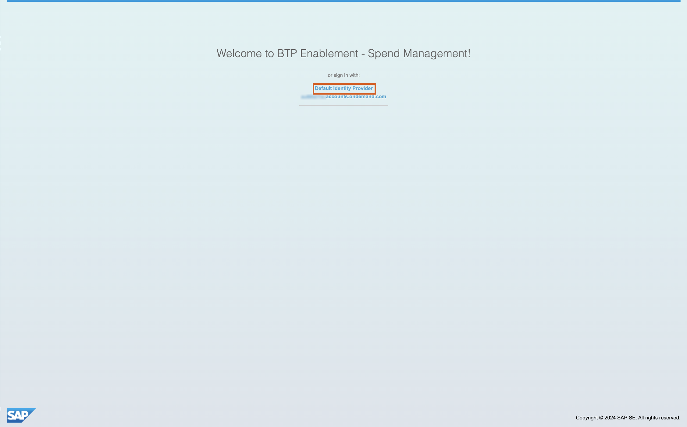
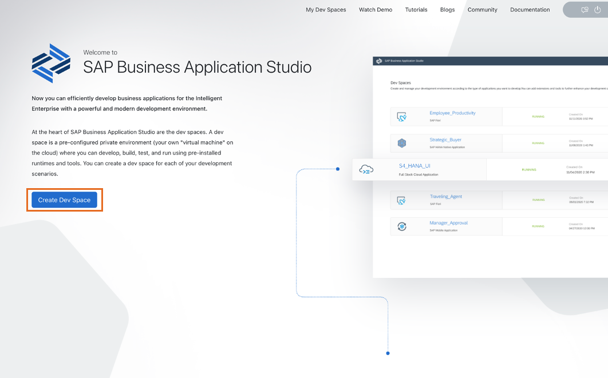
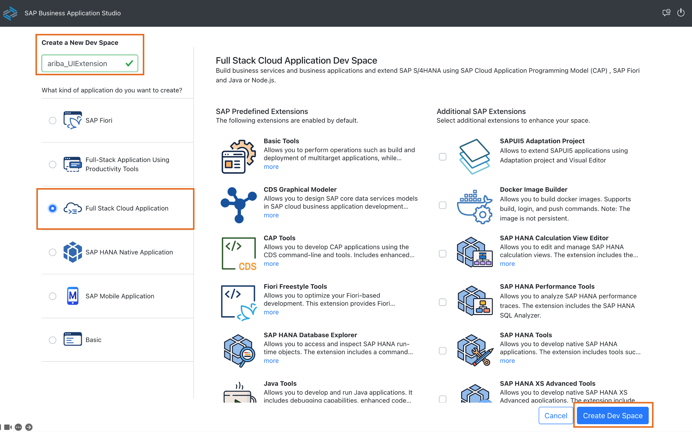

# 1. 開発環境のセットアップ

## 本ステップの全体像
1. SAP Ariba APIの設定
2. SAP BTP 上の開発環境のセットアップ

### 1. SAP Ariba APIの設定

SAP Ariba API からの認証情報の取得やAPI利用の有効化については、下記環境管理者セットアップにて解説しています。
本日は細かくは触れませんが、お手隙の際にぜひご確認ください。

[0. 環境管理者セットアップ](../00_環境管理者セットアップ/README.md)

### 2. SAP BTP 上の開発環境のセットアップ

1. 講師より提示されたURLを用いて、Web上の開発環境である [SAP Business Application Studio](https://discovery-center.cloud.sap/serviceCatalog/business-application-studio?region=all) にアクセスします。ログインの際には、「Default Identity Provider」を選択します。これにより、SAP Universal IDにて認証が走ります。後続のスタート画面にて「Create Dev Space」をクリックします。

2. 下記表の通りに Dev Space の名前を入力し、今回はフロント・バックエンド双方を扱うため、アプリケーションのタイプとして「Full Stack Cloud Application」を選択します。これにより、必要な開発ツール群がプリセットされた開発環境を立ち上げることができます。「Create Dev Space」をクリックします。この後、Dev Space の構築が始まります。完了したらDev Spaceに入ってください。

|   項目   |  値                        |
| -------------- |-------------------------- |
| Dev Space 名    | ariba_UIExtension   |

> [!NOTE]
> DevSpaceについて、より詳しく知りたい場合は下記をご参照ください。 
> [コラム：DevSpaceとは？](../../03_コラム/01_DevSpace.md) 

3. SAP Business Application Studio のトップ画面が表示されます。これで開発環境の設定は完了です。

## 次のステップ

[2. バックエンドアプリの構築](../02_バックエンドアプリの構築/README.md)

### 各ステップ リンク一覧
[1. 開発環境のセットアップ](../01_開発環境のセットアップ/README.md)  
[2. バックエンドアプリの構築](../02_バックエンドアプリの構築/README.md)  
[3. フロントエンドアプリの構築](../03_フロントエンドアプリの構築/README.md)  
[4. デプロイと結果の確認](../04_デプロイと結果の確認/README.md)  