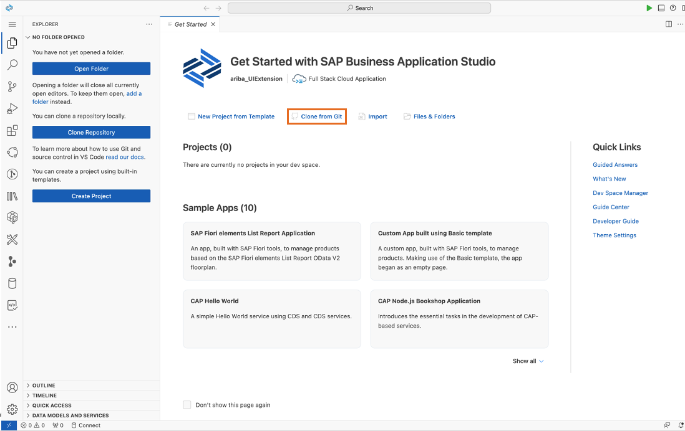

# 1. 開発環境のセットアップ

## ハンズオンの事前準備
1. SAP Ariba APIの設定
2. SAP BTP 上の開発環境のセットアップ

## ハンズオンの手順
ハンズオンを始める前に、以下の事前準備を確認し、必要なツールやアカウントが設定されていることを確認してください。

### 1. SAP Ariba APIの設定

### 2. SAP BTP 上の開発環境のセットアップ

1. 講師より提示されたURLを用いて、Web上の開発環境である [SAP Business Application Studio](https://discovery-center.cloud.sap/serviceCatalog/business-application-studio?region=all) にアクセスします。下記スタート画面にて「Create Dev Space」をクリックします。

2. 下記表の通りに Dev Space の名前を入力し、今回はフロント・バックエンド双方を扱うため、アプリケーションのタイプとして「Full Stack Cloud Application」を選択します。これにより、必要な開発ツール群がプリセットされた開発環境を立ち上げることができます。「Create Dev Space」をクリックします。この後、Dev Space の構築が始まります。完了したらDev Spaceに入ってください。

|   項目   |  値                        |
| -------------- |-------------------------- |
| Dev Space 名    | ariba_UIExtension   |

3. SAP Business Application Studio のトップ画面が表示されます。今回は講師の方で用意したソースコードを利用しますので、「Clone from Git」をクリックしてください。

