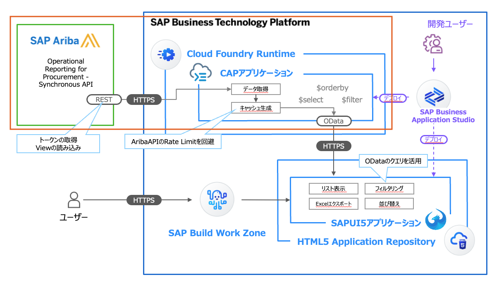
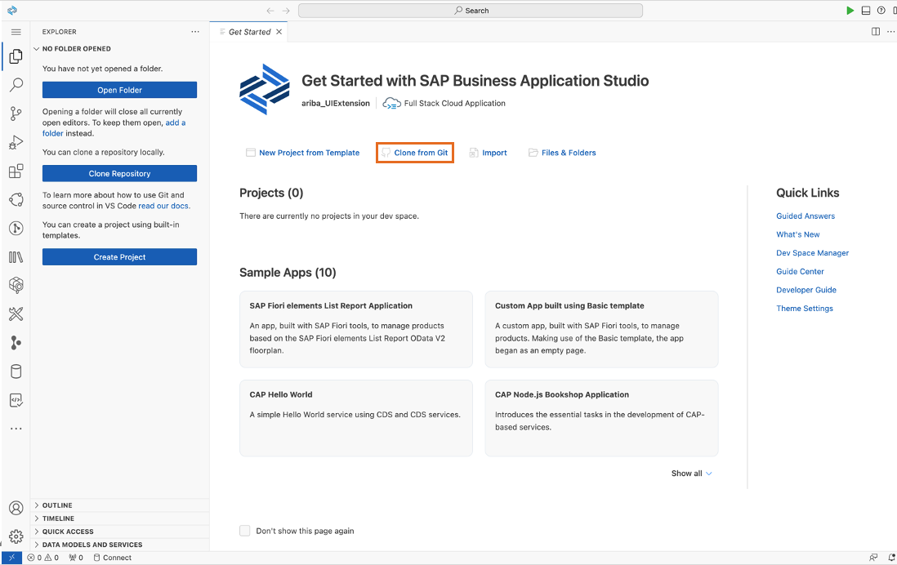
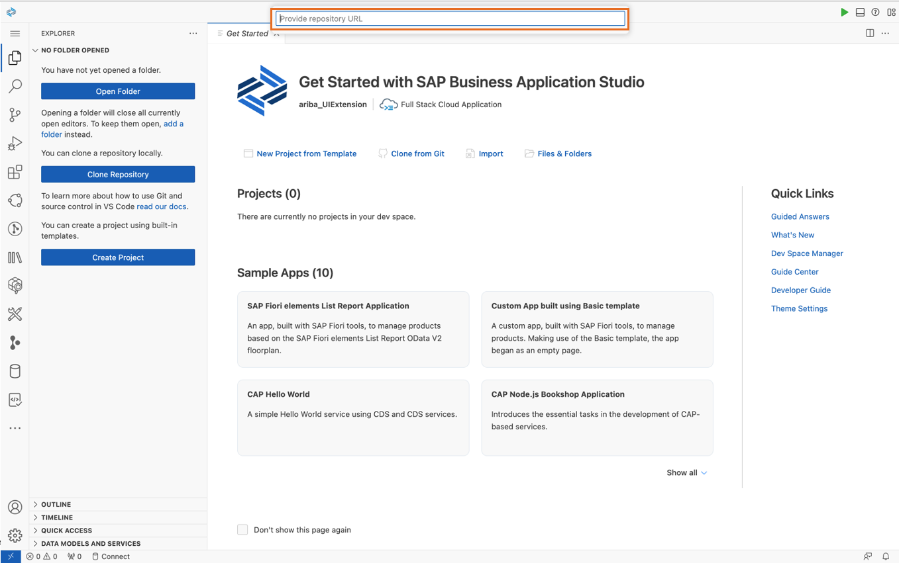
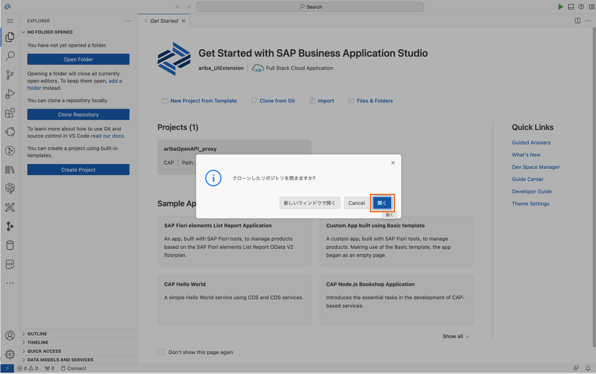
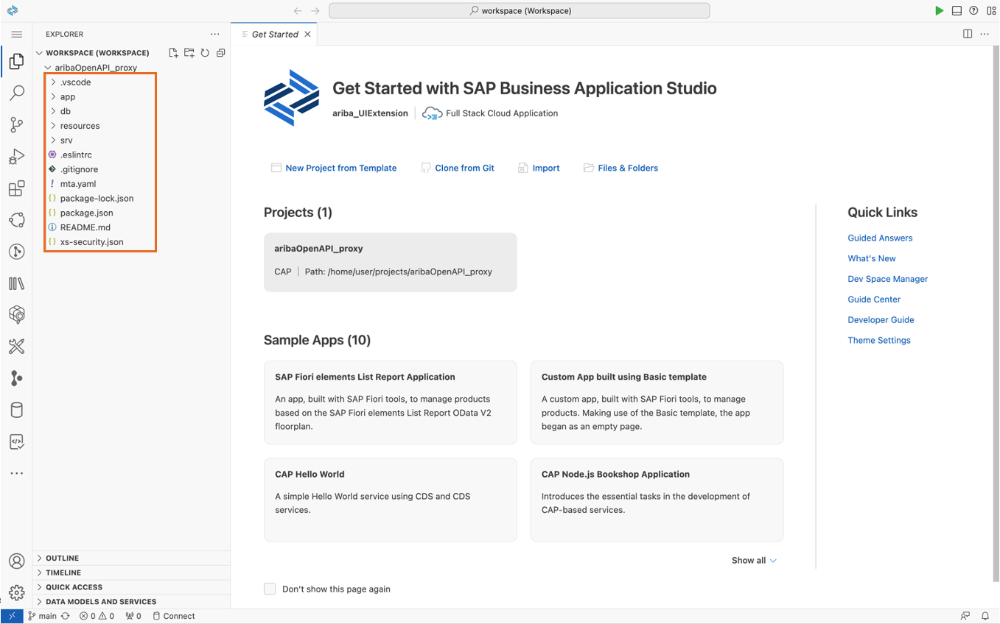
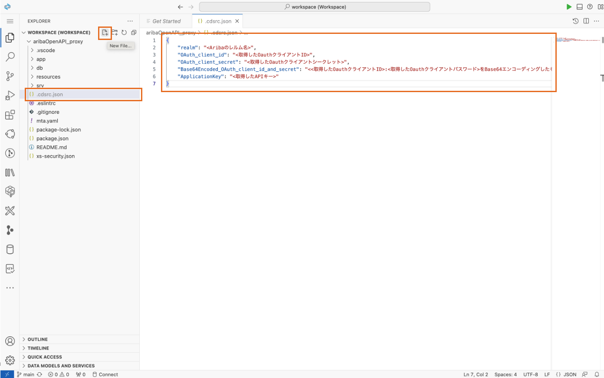
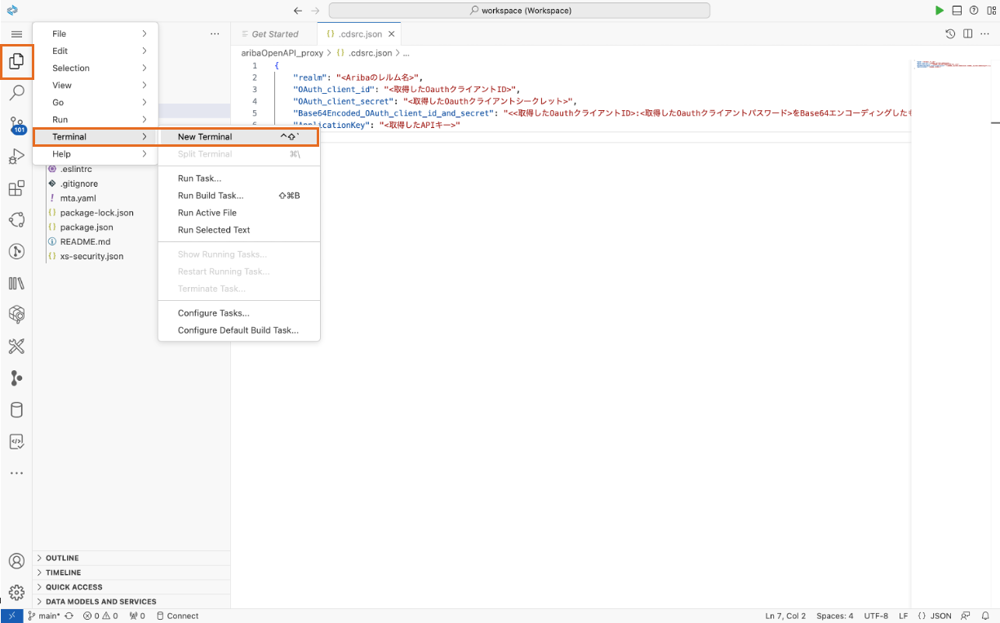
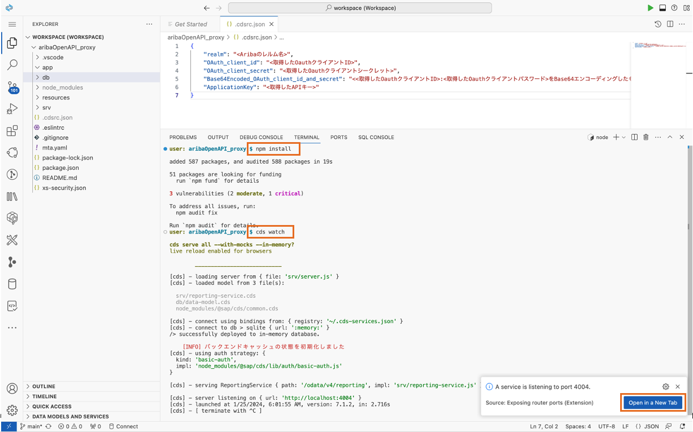
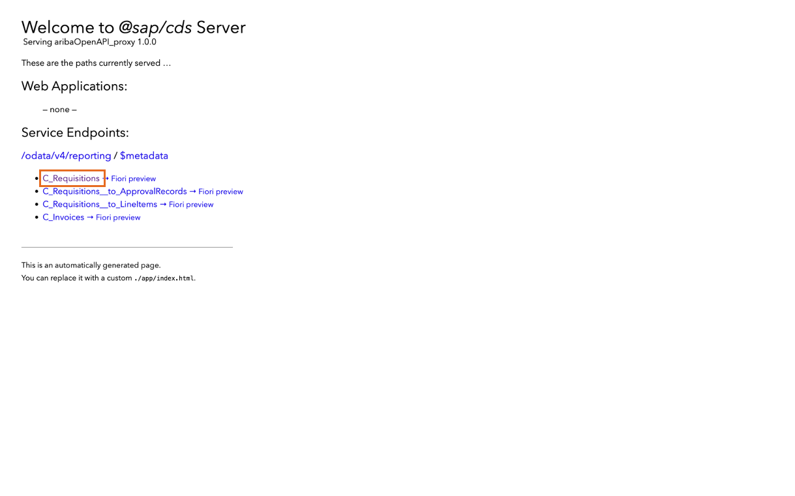
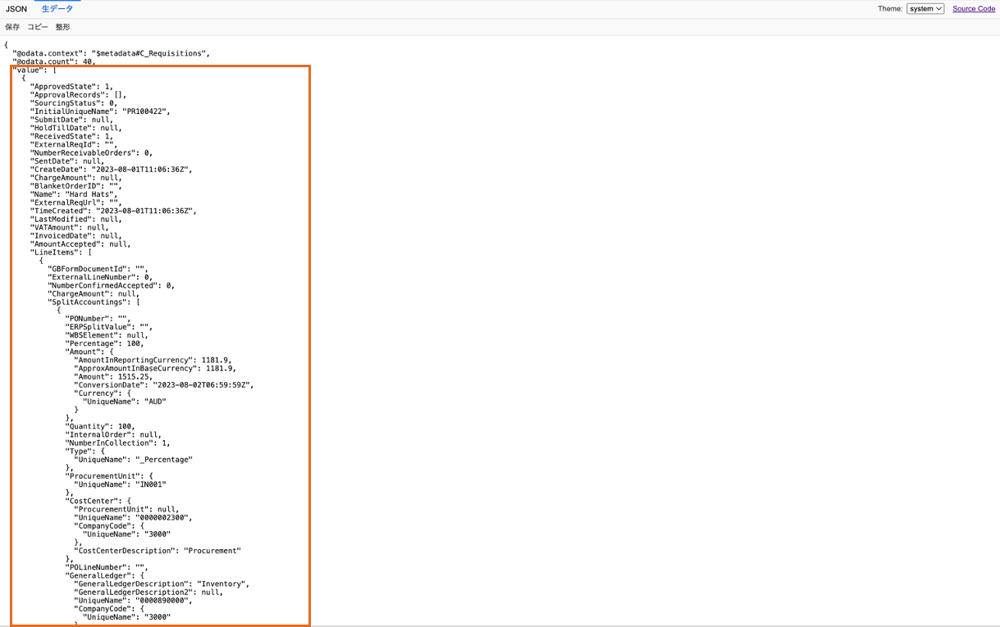

# 2. バックエンドアプリの構築

> 本ステップでは、下図赤枠の部分について実装を行います。
> 

## 本マニュアルのステップの全体像
1. ソースコードの入手
2. 環境変数の設定
3. プレビュー実行

### 1. ソースコードの入手
1. 今回は講師の方で用意したソースコードを活用しますので、「Clone from Git」をクリックしてください。



2. 画面上部に表示される入力欄に、下記リポジトリURLをペーストしてEnterをクリックします。

|   項目   |         値     |
| -------------- |-------------------------- |
| リポジトリURL    | https://github.com/watwatwhat/ariba_BTPextension_HandsOn_src.git |



3. ポップアップが表示されたら「開く」をクリックしてクローンしたフォルダに移動します。



4. プロジェクトがクローンされたことが確認できます。



このプロジェクトのディレクトリ構成は以下の通りです。

| ディレクトリ | | 内容 |
| ---------------------- | ---- | ------------------------ |
| `./app`               | | UIフロントエンドのソースコード(フロントエンド本体) |
| `./db`                | | アプリ内で利用されるドメインモデルとデータ |
|  | `/data-model.cds` | ドメインモデル |
| `./srv`               | | アプリ内で利用されるサービスモデルとカスタムハンドラ(バックエンド本体) |
|  | `/server.js` | CORS設定をコントロールするミドルウェアを実装 |
|  | `/reporting-service.cds` | サービスモデル |
|  | `/reporting-service.js` | カスタムハンドラ |
|  | `/external/aribaOpenAPI.js` | AribaのAPIを呼び出すカスタムモジュール |
|  | `/lib/designTimeTools.js` | コーディング時に利用するカスタムモジュール |
|  | `/lib/queryOptionParser.js` | フロントエンドからのODataクエリをパースするカスタムモジュール |
|  | `/lib/responseProcessor.js` | フロントエンドへのODataレスポンスを$selectや$orderbyにより調整するカスタムモジュール |
| `./xs-security.json`       | | アプリを利用するために必要な権限ロールの設定 |
| `./mta.yaml`           | | Multi Target Application (mta) : BTP上のマイクロサービスを横断・統合したデプロイ設定 |
| `./package.json`       | | プロジェクトのメタデータと設定 |
| `./README.md`          | | 本スタートガイド |


## 2. 環境変数の設定
SAP Ariba 環境のAPIキーやレルム等の情報については、セキュリティ上の理由でgitリポジトリの管理から排除しています。
この章では、皆さまそれぞれのAriba環境に接続するため、環境変数を設定していきます。

1. プロジェクトのルートディレクトリに`.cdsrc.json`を追加します。中身には、以下の通りに入力して保存してください。これはAriba環境に関する設定データであり、プロジェクトに環境変数として読み込まれます。

```json
{
    "realm": "<Aribaのレルム名>",
    "OAuth_client_id": "<取得したOauthクライアントID>",
    "OAuth_client_secret": "<取得したOauthクライアントシークレット>",
    "Base64Encoded_OAuth_client_id_and_secret": "<<取得したOauthクライアントID>:<取得したOauthクライアントパスワード>をBase64エンコーディングしたもの>",
    "ApplicationKey": "<取得したAPIキー>"
}
```



## 3. プレビュー実行
それでは早速、アプリケーションを実行してみましょう。

1. 図の通りにターミナルを開きます。



2. 以下のコマンドを実行して、依存関係のインストールを行った上でプレビューを実行します。すると、このDev Spaceコンテナ内でプレビューアプリケーションが立ち上がります。右下の「Open in a New Tab」からプレビューを開きます。

```bash
npm install
```

> [!NOTE]
> npm は今回用いているNode.jsのパッケージ管理ツールです。<br>
> npm install を実行すると、同じフォルダ内に存在する package.json に記載された依存パッケージが一括でインストールされます。

```bash
cds watch
```

> [!NOTE]
> cds watch は、CAPアプリケーションをプレビューするためのコマンドです。<br>
> このコマンドを実行するとCAPサーバーがローカル（今回はSAP Business Applciation StudioのDevSpace内）で立ち上がります。



3. CAPサーバーの画面が立ち上がります。この画面では、ソースコード内でODataエンティティとして定義されているデータの一覧が表示されています。メインのエンティティである「C_Requisitions」をクリックしてください。



4. SAP Ariba の Operational Regional API から取得したデータを OData (もどき) に変換してクライアントに返却しています。SAP Ariba の Operational Regional API 側の制約により、最大表示件数は40件です。



> [!WARNING]
> 既知の制約として、最大表示件数が40件となります。これはSAP Ariba Operational Reporting API の1回あたりの最大返答レコード数が40であることに依存しています。
> より多くのレコードを一覧化する必要がある場合には、そのハンドリングロジックをCAPアプリケーション内に記述する必要があります。

> [!NOTE]
> アプリケーションのソースコード解説については、下記をご参照ください。<br>
> [コラム：今回のアプリケーションの仕組み](../../03_コラム/02_ApplicationLogic.md) 

## 次のステップ

[3. フロントエンドアプリの構築](../03_フロントエンドアプリの構築/README.md)

### 各ステップ リンク一覧
[1. 開発環境のセットアップ](../../01_開発環境のセットアップ/README.md) <br>
[2. バックエンドアプリの構築](../../02_バックエンドアプリの構築/README.md) <br>
[3. フロントエンドアプリの構築](../../03_フロントエンドアプリの構築/README.md) <br>
[4. デプロイと結果の確認](../../04_デプロイと結果の確認/README.md) <br>