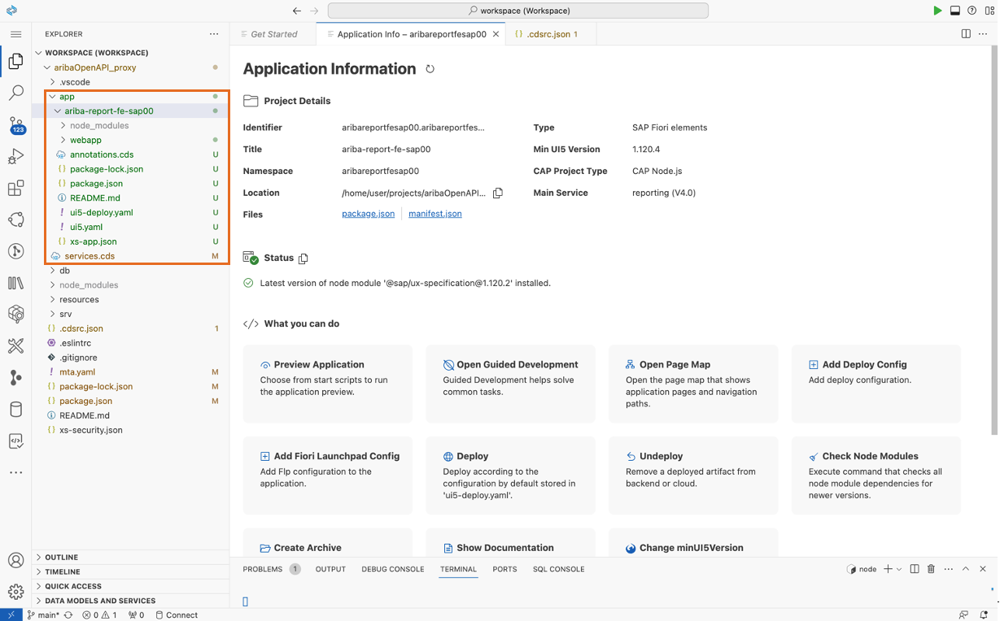

# 3. フロントエンドアプリの構築

> [!NOTE]
> 本ステップでは、下図赤枠の部分について実装を行います。<br>
> <br>
> 


## 本マニュアルのステップの全体像
1. Application Generator を起動
2. Fiori Elements を利用したフロントエンドアプリ生成


### 1. Application Generator を起動

1. 画面上部の入力欄に「 >application generator 」と入力すると、「 Fiori: Open Application Generator 」が表示されます。これをクリックしてアプリケーションジェネレーターを起動してください。


### 2. Fiori Elements を利用したフロントエンドアプリ生成

1. Fiori Elements のテンプレート一覧が表示されます。今回は「List Report Page」を選択し「Next」をクリックしてください。


2. データソースについて入力するページが開きます。表の通りに入力し「Next」をクリックします。

|   項目   |         値                             |
| -------------- |--------------------------       |
| Data source    | Use a Local CAP Project         |
| Choose your CAP project   | ariba_BTPextension_HnadsOn_src   |
| OData service    | Reporting Service (Node.js)   |


3. エンティティを表の通りに入力し「Next」をクリックします。

|   項目   |         値                             |
| -------------- |--------------------------       |
| Main Entity    | C_Requisitions         |
| Navigation Entity   | None   |
| Automatically ...   | Yes   |


4. プロジェクトの設定を表の通りに入力し「Next」をクリックします。

|   項目   |         値                             |
| -------------- |--------------------------       |
| Module name    | ariba-report-fe-<ユーザーID>         |
| Application title   | ariba-report-fe-<ユーザーID>   |
| Application namespace   | aribareportfe<ユーザーID>   |
| Description   | AribaレポートFioriアプリ   |
| Minimum SAPUI5 version   | 1.120.4   |
| Add deployment...   | Yes   |
| Add FLP configration   | No   |
| Advanced configration   | No   |


5. デプロイ設定を表の通りに入力し「Finish」をクリックします。

|   項目                       |         値               |
| --------------------------- |-----------------------   |
| Please choose the target    | Cloud Foundry            |
| Destination name            | None                     |

> [!WARNING]
> 「Finish」をクリックすると、フロントエンドアプリケーション (UI) の自動生成が始まります。<br>
> 「Files have been generated.」のポップアップが出るまで、画面は操作せずに待機してください。<br>


6. `./app` 配下にフロントエンドのアプリケーションが生成されます。



> [!TIP]
> 「Application Info」の画面を閉じてしまった場合、もしくは自動で開かない場合は、以下のように開いてください。<br>
> `./app/ariba-report-fe-<ユーザーID>` 上で右クリック -> 「Open Application Info」をクリック <br>
> <br>
> 

7. この状態で先ほどのプレビューを開くと、「Web Applications」の部分に `/ariba-report-fe-<ユーザー名>/webapp/index.html` が表示されているはずです。こちらをクリックしてください。


> [!TIP]
> 必要に応じて、以下コマンドを用いてアプリケーションのプレビューを再起動してください。<br>
> ```bash
> cds watch
> ``` 
> 以下の図のようなエラーが出た場合は、先ほど立ち上げたプレビューアプリケーションが安全にシャットダウンされていないことを意味しています。
> Enterキーを押すと他のポートで新しくプレビューアプリケーションを起動できます。<br>
> <br>
> 

8. 半自動で生成された Fiori アプリケーションが確認できます。「開始」ボタンをクリックすると、バックエンドアプリがSAP Aribaからのデータを収集し、Fioriアプリが扱える OData (もどき) の形に整形してフロントエンドに送信します。これにより、Fiori の画面で SAP Ariba のデータを確認することが可能です。

> [!NOTE]
> ODataについて、より詳しく知りたい場合は下記をご参照ください。<br>
> [コラム：OData API とは？](../../03_コラム/05_OData.md) 


## 次のステップ

[4. デプロイと結果の確認](../04_デプロイと結果の確認/README.md)

### 各ステップ リンク一覧
[1. 開発環境のセットアップ](../01_開発環境のセットアップ/README.md) <br>
[2. バックエンドアプリの構築](../02_バックエンドアプリの構築/README.md) <br>
[3. フロントエンドアプリの構築](../03_フロントエンドアプリの構築/README.md) <br>
[4. デプロイと結果の確認](../04_デプロイと結果の確認/README.md) <br>