# 4. デプロイと結果の確認

## 本マニュアルのステップの全体像
1. UI デプロイ設定の追加
2. プロジェクトのビルド
3. プロジェクトのデプロイ
4. 結果の確認

### 1. UI デプロイ設定の追加

> [!WARNING]
> 下記「Managed Approuter へのデプロイ設定」と「Fiori UIアプリケーションからバックエンドODataサービスへの宛先設定」は、必ず指定の順番で実行してください。 
> 逆に実行すると互いに設定を上書きしてしまい、期待した動作が実行できません。 
> もし逆に実行してしまった場合は、「Fiori UIアプリケーションからバックエンドODataサービスへの宛先設定」を再度実行してください。

#### デプロイ設定ファイルをご自身用にカスタマイズ
0. `mta.yaml`内の`sap00`を`<ユーザーID>`に変換してください。
> [!WARNING]
> ユーザーIDには「.」を含めないでください。含むとエラーになります。

> [!TIP]
> sap00 を範囲選択した状態で ctrl + D を押下すると、ファイル内の他のsap00が一つづつ追加で範囲選択されます。 
> 全てのsap00を選択した状態で バックスペース を押下すると全ての街灯部分が削除されます。
> その状態で <ユーザーID> を入力すると、全ての該当箇所に同時に入力ができます。

#### Managed Approuter へのデプロイ設定

1. `mta.yaml` ファイル上で右クリックをしてください。表示されるメニューのうち「 Create MTA Module from Template 」をクリックします。

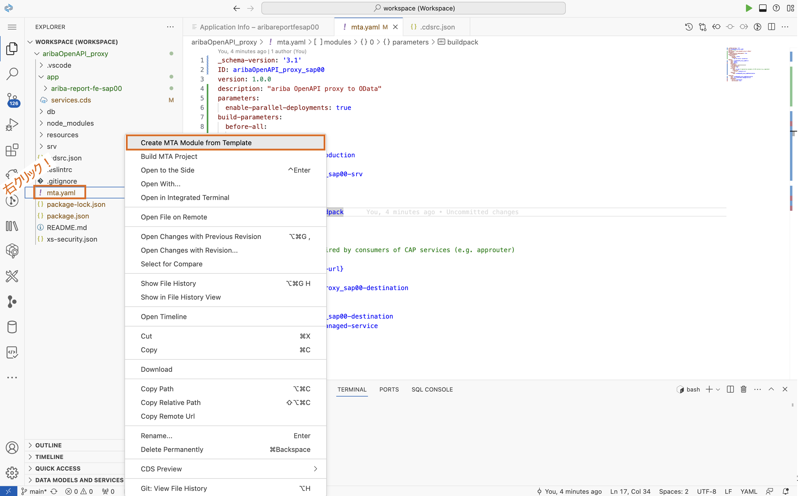

2. 「Approuter Configration」をクリックします。

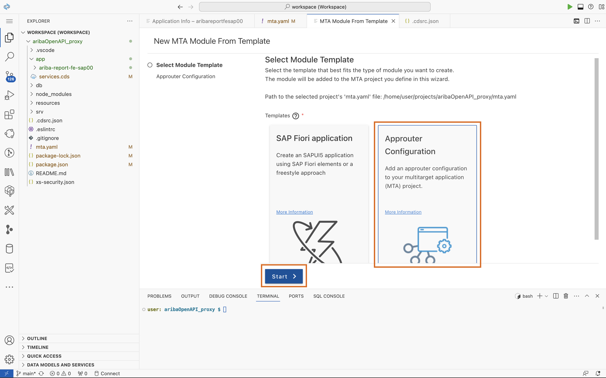

3. 表の通りに記入し「Next」をクリックします。

|   項目   |         値                             |
| -------------- |--------------------------       |
| Select fyour HTML5 application runtime    | Managed Approuter         |
| Enter a unique business solution ...   | ManagedApprouter-<ユーザーID>   |
| Do you plan to add a UI ?    | Yes  |

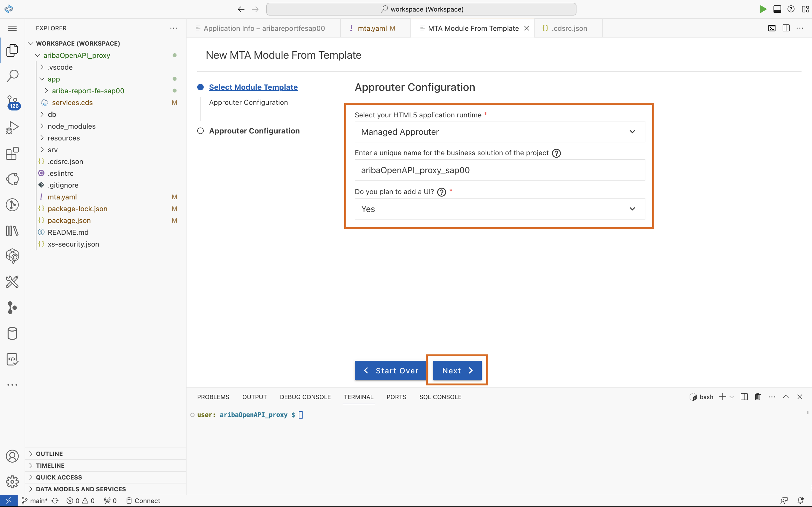

> [!NOTE]
> この作業により、Managed Approuterを利用するという設定が行われました。 
> 「Managed Approuter」とは何か？なぜ必要なのか？について、より詳しく知りたい場合は下記をご参照ください。 
> [コラム：Managed Approuter](../../03_コラム/04_managedApprouter.md)

> [!NOTE]
> ここで、XSUAAサービスやDestinationサービスというマイクロサービスが、本アプリケーションにバインドされています。 
> これらについてより詳しく知りたい場合は下記をご参照ください。 
> [コラム：XSUAAサービス / Destinationサービス ](../../03_コラム/06_XSUAA_Destination.md)

4. デプロイに関する設定ファイルである `mta.yaml` に UI デプロイに関わる情報が付加されます。

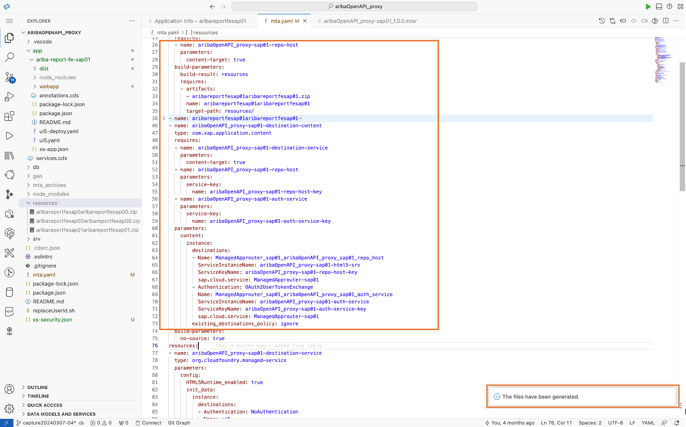

#### Fiori UIアプリケーションからバックエンドODataサービスへの宛先設定

5. 生成された Fiori アプリケーション（画面を表示するフロントエンドアプリ）の管理コンソールで、「Add Deploy Config」をクリックします。

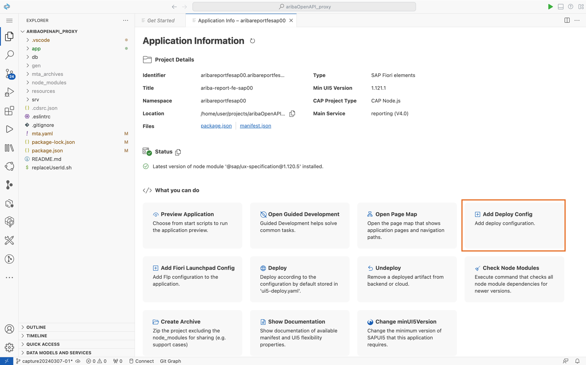

> [!TIP]
> 「Application Info」の画面を閉じてしまった場合は、以下のように開いてください。 
> `./app/ariba-report-fe-<ユーザーID>` 上で右クリック -> 「Open Application Info」をクリック 
>  
> 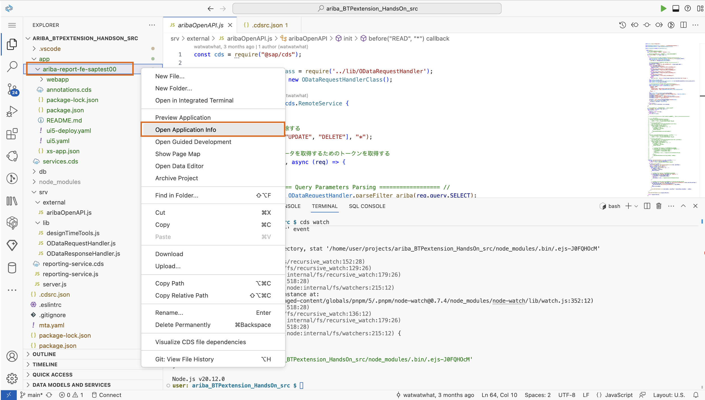

6. ローカルのCAPプロジェクトにより提供されるODataサービスをポイントします。

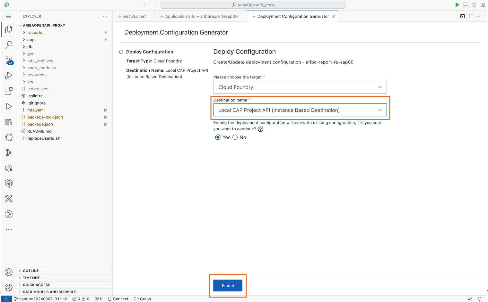

7. これにより、`./app/ariba-report-fe-<ユーザーID>/xs-app.json` に以下の設定が追加されます。
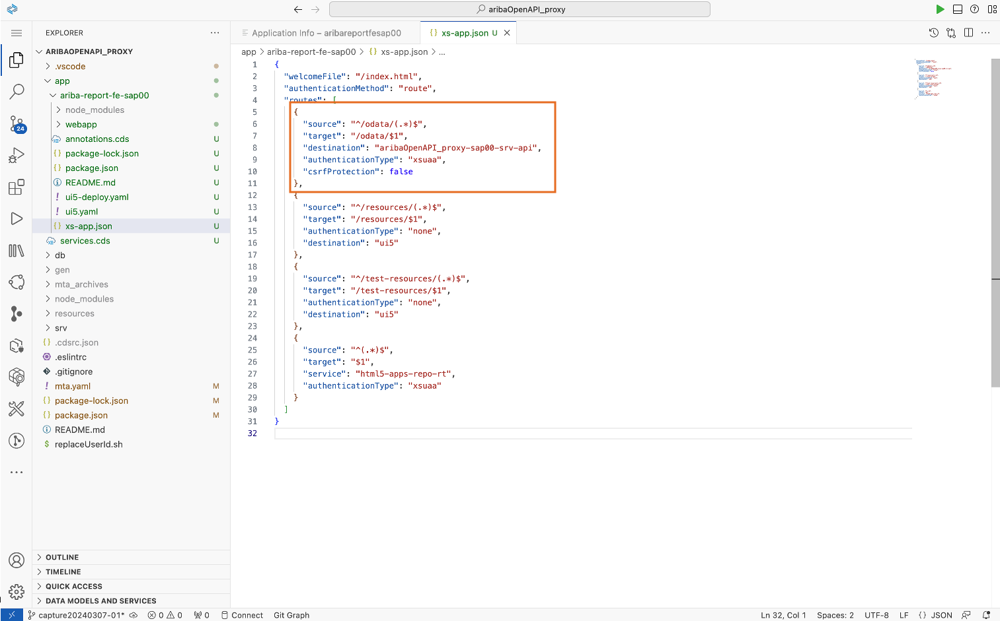

8. `mta.yaml`には以下の設定が追加されます。
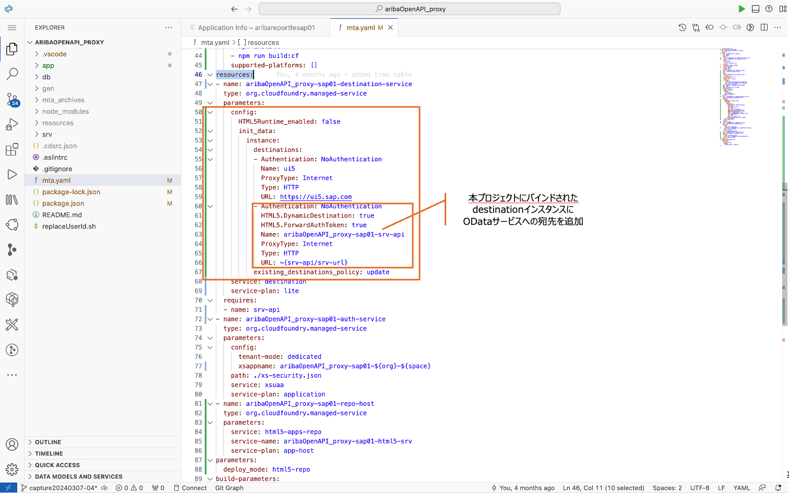

> [!NOTE]
> Multi Target Application (MTA) のデプロイアーキテクチャについて、より詳しく知りたい場合は下記をご参照ください。 
> [コラム：デプロイアーキテクチャ](../../03_コラム/03_DeployArchitecture.md)

### 2. プロジェクトのビルド

1. `mta.yaml` ファイル上で右クリックをしてください。表示されるメニューのうち「 Build MTA Project 」をクリックします。

> [!WARNING]
> 自動で新規ターミナルが生成され、一連のビルド作業が実行されます。
> 「Terminal will be reused by tasks, press any key to close it.」と表示されるまで、**ターミナルには触れずに待機**してください。 

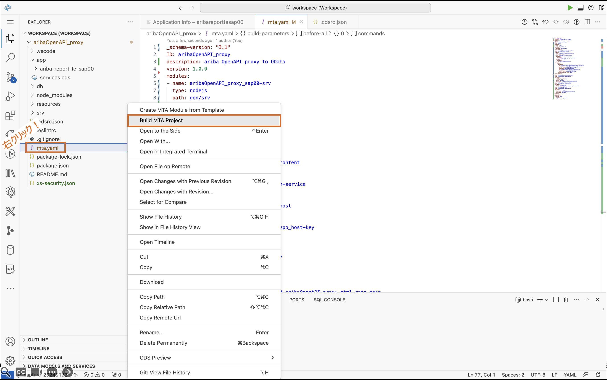

2. `mta_archives/aribaOpenAPI_proxy-<ユーザーID>_1.0.0.mtar` が生成されます。

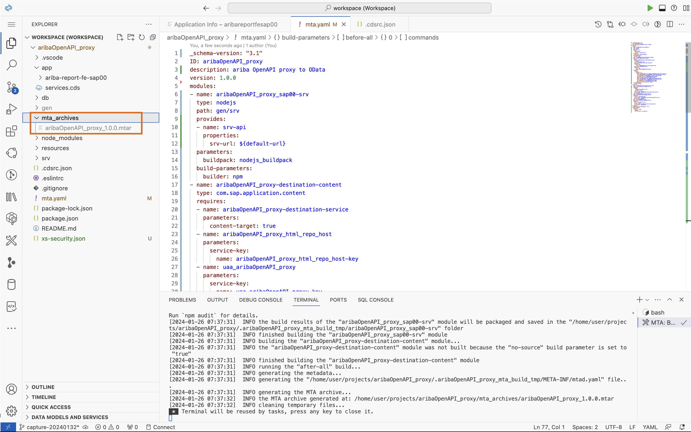

### 3. プロジェクトのデプロイ

1. `mta_archives/aribaOpenAPI_proxy-<ユーザーID>_1.0.0.mtar` ファイル上で右クリックをしてください。表示されるメニューのうち「 Deploy MTA Archive 」をクリックします。

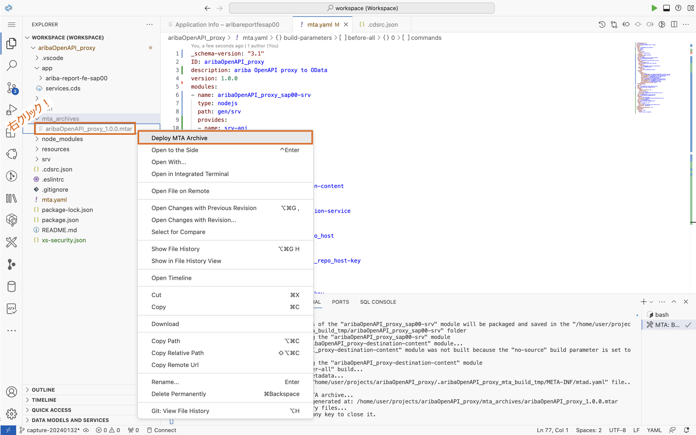

2. 皆様の SAP Universal ID の ID/Password を用いて、Cloud Foundry 環境にログインしてください。

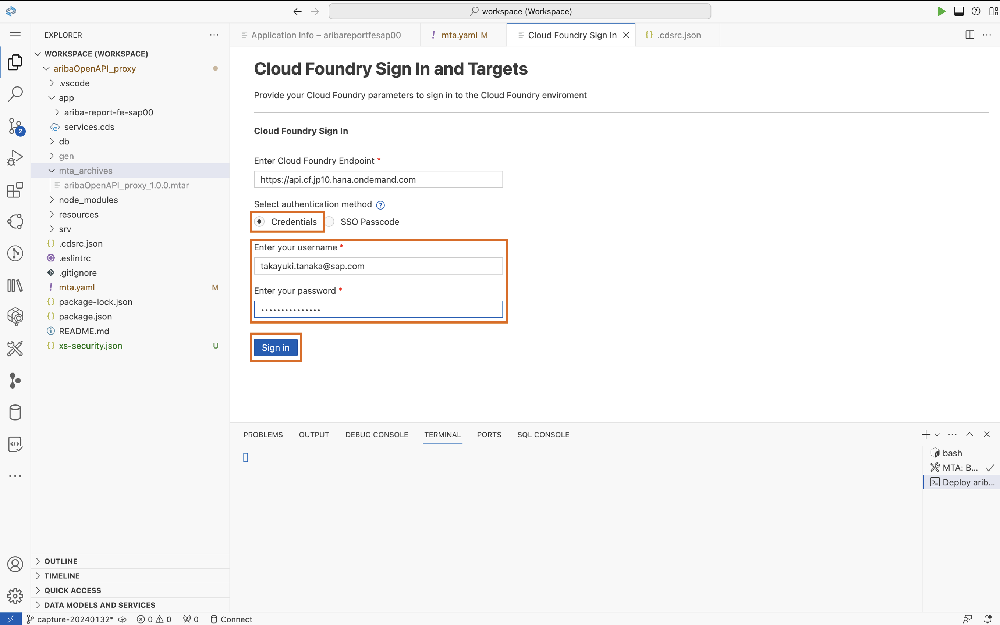

3. 講師の提示した Cloud Foundry スペース (アプリケーションの実行環境) を選択してください。

>[!TIP]
> 今回は以下に従って環境を選択してください。 
> 
> サブアカウント「btp-enablement-spend-management-be6rsumq」 
> スペース「development」 

> [!WARNING]
> 「Apply」をクリックすると、自動で新規ターミナルが生成され、一連のデプロイ作業が実行されます。
> この作業は **2~5分程度** かかります。
> 「Terminal will be reused by tasks, press any key to close it.」と表示されるまで、**ターミナルには触れずに待機**してください。 

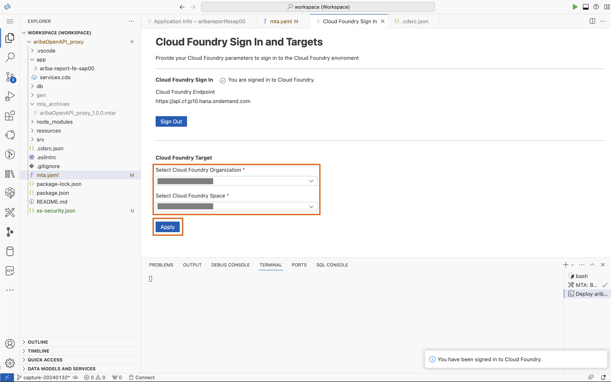

4. デプロイが無事完了しました。

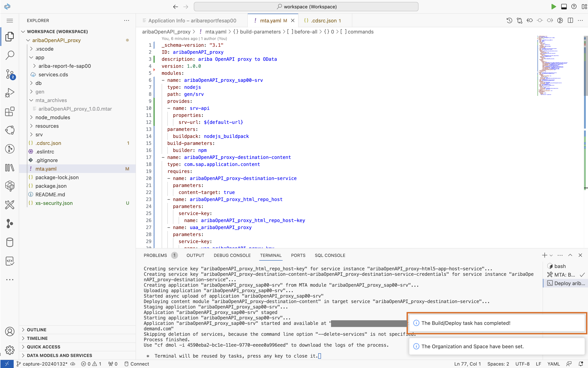

### 4. 結果の確認

1. 講師の提示したURLより、SAP HTML5 Application Repository にアクセスし、「aribareportfe<ユーザーID>」にアクセスします。

>[!NOTE]
> [SAP HTML5 Application Repository](https://discovery-center.cloud.sap/serviceCatalog/html5-application-repository-service?region=all) は SAP BTP 上で提供されているWebサーバのマネージドサービスです。
> NginxやApacheサーバーを自前で建てることなく、開発したフロントエンドアプリケーションをデプロイすることが可能です。

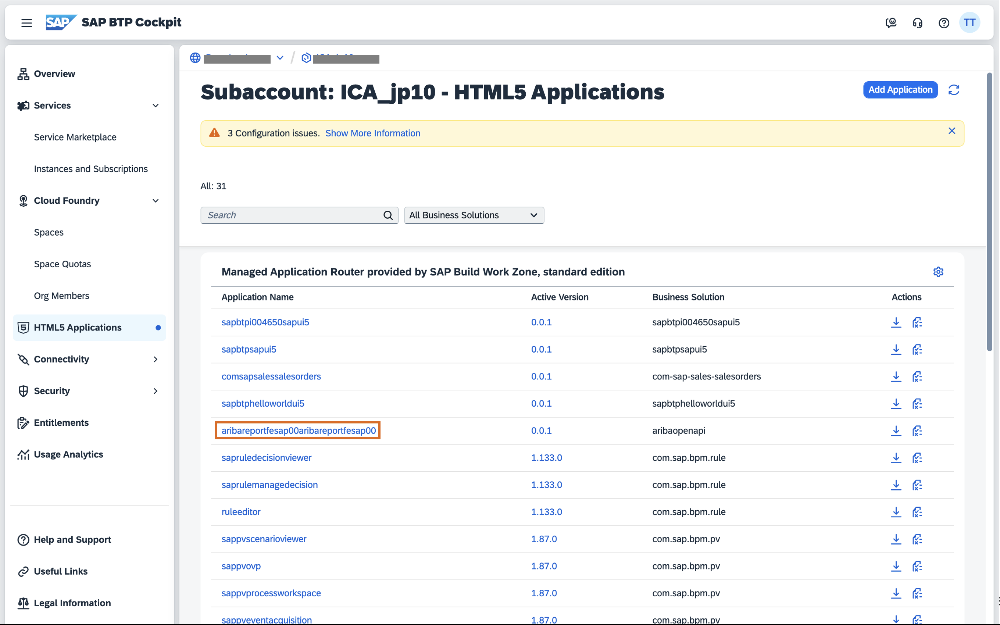

2. パブリックにアクセス可能な UIアプリケーション の完成です。

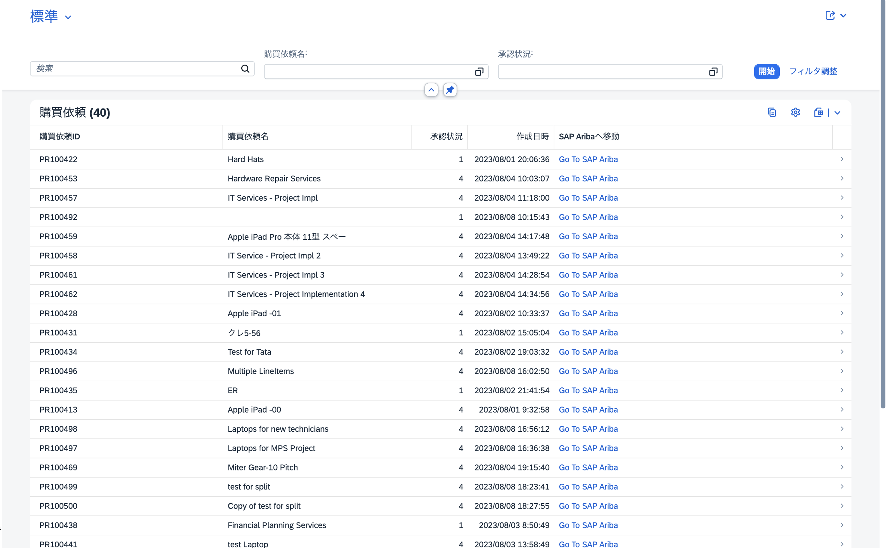

## 最初に戻る
[SAP Ariba x SAP BTP による Side-by-Side拡張 ハンズオン](../../README.md)

### 各ステップ リンク一覧
[1. 開発環境のセットアップ](../01_開発環境のセットアップ/README.md)  
[2. バックエンドアプリの構築](../02_バックエンドアプリの構築/README.md)  
[3. フロントエンドアプリの構築](../03_フロントエンドアプリの構築/README.md)  
[4. デプロイと結果の確認](../04_デプロイと結果の確認/README.md)  
