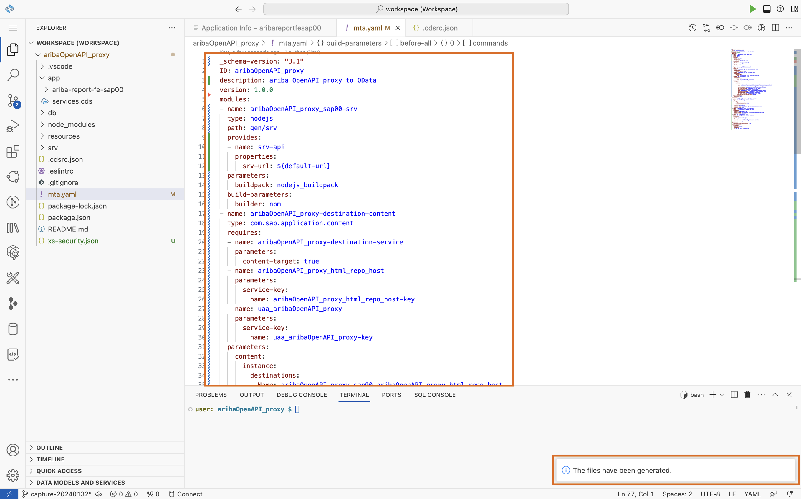

# 4. デプロイと結果の確認

## 本マニュアルのステップの全体像
1. UI デプロイ設定の追加
2. プロジェクトのビルド
3. プロジェクトのデプロイ
4. 結果の確認

### 1. UI デプロイ設定の追加

1. `mta.yaml` ファイル上で右クリックをしてください。表示されるメニューのうち「 Create MTA Module from Template 」をクリックします。

2. 「Approuter Configration」をクリックします。

3. 表の通りに記入し「Next」をクリックします。

|   項目   |         値                             |
| -------------- |--------------------------       |
| Select fyour HTML5 application runtime    | Managed Approuter         |
| Enter a unique business solution ...   | aribaOpenAPI_proxy_<ユーザーID>   |
| Do you plan to add a UI ?    | Yes  |

4. デプロイに関する設定ファイルである `mta.yaml` に UI デプロイに関わる情報が付加されます。

### 2. プロジェクトのビルド

1. `mta.yaml` ファイル上で右クリックをしてください。表示されるメニューのうち「 Build MTA Project 」をクリックします。

2. `mta_archives/aribaOpenAPI_proxy_1.0.0.mtar` が生成されます。

### 3. プロジェクトのデプロイ

1. `mta_archives/aribaOpenAPI_proxy_1.0.0.mtar` ファイル上で右クリックをしてください。表示されるメニューのうち「 Deploy MTA Archive 」をクリックします。

2. 講師の提示した ID/Password を用いて、Cloud Foundry 環境にログインしてください。

3. 講師の提示した Cloud Foundry スペース (アプリケーションの実行環境) を選択してください。

4. デプロイが無事完了しました。

### 4. 結果の確認

1. 講師の提示したURLより、HTML5 Application Repository にアクセスし、「aribareportfe<ユーザーID>」にアクセスします。

2. パブリックにアクセス可能な UIアプリケーション の完成です。

## 最初に戻る

[SAP Ariba x SAP BTP による Side-by-Side拡張 ハンズオン](../../README.md)