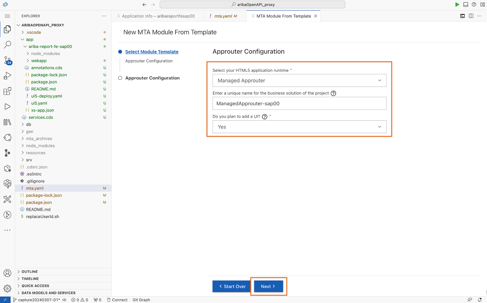
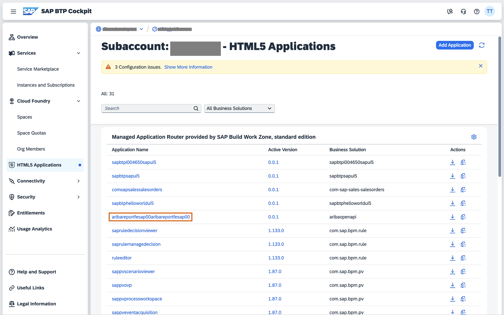

# 4. デプロイと結果の確認

## 本マニュアルのステップの全体像
1. UI デプロイ設定の追加
2. プロジェクトのビルド
3. プロジェクトのデプロイ
4. 結果の確認

### 1. UI デプロイ設定の追加

> 下記「Managed Approuter へのデプロイ設定」と「Fiori UIアプリケーションからバックエンドODataサービスへの宛先設定」は、必ず指定の順番で実行してください。 
> 逆に実行すると互いに設定を上書きしてしまい、期待した動作が実行できません。 
> もし逆に実行してしまった場合は、「Fiori UIアプリケーションからバックエンドODataサービスへの宛先設定」を再度実行してください。

#### デプロイ設定ファイルをご自身用にカスタマイズ
0. `mta.yaml`内の`sap00`を`<ユーザーID>`に変換してください。

#### Managed Approuter へのデプロイ設定

1. `mta.yaml` ファイル上で右クリックをしてください。表示されるメニューのうち「 Create MTA Module from Template 」をクリックします。

2. 「Approuter Configration」をクリックします。

3. 表の通りに記入し「Next」をクリックします。

|   項目   |         値                             |
| -------------- |--------------------------       |
| Select fyour HTML5 application runtime    | Managed Approuter         |
| Enter a unique business solution ...   | ManagedApprouter-<ユーザーID>   |
| Do you plan to add a UI ?    | Yes  |

4. デプロイに関する設定ファイルである `mta.yaml` に UI デプロイに関わる情報が付加されます。

#### Fiori UIアプリケーションからバックエンドODataサービスへの宛先設定

5. 生成された Fiori アプリケーション（画面を表示するフロントエンドアプリ）の管理コンソールで、「Add Deploy Config」をクリックします。

6. ローカルのCAPプロジェクトにより提供されるODataサービスをポイントします。

7. これにより、`./app/ariba-report-fe-<ユーザーID>/xs-app.json` に以下の設定が追加されます。

8. `mta.yaml`には以下の設定が追加されます。

> ここって何をしているの？ 
> [デプロイアーキテクチャ](../../03_コラム/デプロイアーキテクチャ.md)

### 2. プロジェクトのビルド

1. `mta.yaml` ファイル上で右クリックをしてください。表示されるメニューのうち「 Build MTA Project 」をクリックします。

2. `mta_archives/aribaOpenAPI_proxy-<ユーザーID>_1.0.0.mtar` が生成されます。

### 3. プロジェクトのデプロイ

1. `mta_archives/aribaOpenAPI_proxy-<ユーザーID>_1.0.0.mtar` ファイル上で右クリックをしてください。表示されるメニューのうち「 Deploy MTA Archive 」をクリックします。

2. 講師の提示した ID/Password を用いて、Cloud Foundry 環境にログインしてください。

3. 講師の提示した Cloud Foundry スペース (アプリケーションの実行環境) を選択してください。

4. デプロイが無事完了しました。

### 4. 結果の確認

1. 講師の提示したURLより、HTML5 Application Repository にアクセスし、「aribareportfe<ユーザーID>」にアクセスします。

2. パブリックにアクセス可能な UIアプリケーション の完成です。

## 最初に戻る

[SAP Ariba x SAP BTP による Side-by-Side拡張 ハンズオン](../../README.md)