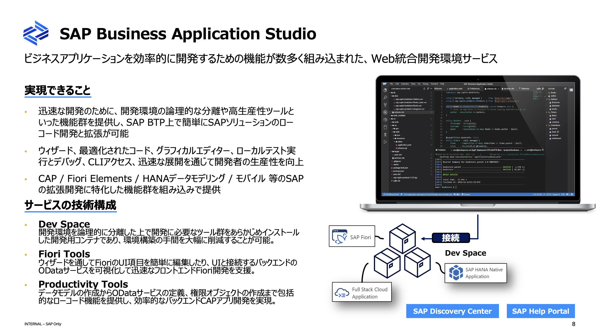

# SAP Business Application Studio - DevSpace の概念

## 概要
SAP Business Application Studio（BAS）のDevSpaceは、開発者が特定の開発シナリオに必要なツールやリソースを集約したクラウドベースの開発環境です。DevSpaceを使用することで、ユーザーは迅速に開発作業を開始でき、効率的にアプリケーションの開発が進められます。

## DevSpaceの主な利点
### 1. **迅速な開発環境の構築**
DevSpaceは、特定の開発ニーズに応じて事前に構成された開発環境を提供します。これにより、開発者は必要なツールや拡張機能を手動でインストールする手間が省け、すぐに開発に着手することが可能です。

### 2. **カスタマイズ可能な開発環境**
必要に応じてDevSpaceに追加のツールや拡張機能をインストールすることができ、開発者のニーズに応じた柔軟な環境を構築できます。これにより、SAPおよび非SAPシステムとの統合が容易になります。

### 3. **統一された開発体験**
SAP Business Application Studioは、Visual Studio Codeに似たインターフェースを持ち、開発者にとって親しみやすい環境を提供します。これにより、他のIDEからの移行がスムーズに行えます。

## 技術的な背景
### 1. **Eclipse Theiaを基盤としたアーキテクチャ**
SAP Business Application Studioは、Eclipse Theiaを基盤として構築されており、業界標準の技術を取り入れています。これにより、高度な開発機能と拡張性が提供されます。

### 2. **クラウドネイティブな設計**
BASはクラウドネイティブな設計となっており、インターネット接続とブラウザがあればどこからでもアクセス可能です。これにより、開発チームは地理的に分散していても一貫した開発環境を共有できます&。

### 3. **SAPとの深い統合**
BASは、SAP S/4HANAやSAP FioriなどのSAP製品と緊密に統合されており、これらの環境での開発が容易に行えます。 
特に、SAP Fioriに準拠したアプリケーションの開発や、SAP Cloud Application Programming Modelを用いた開発がサポートされています。

## 体験的な価値
### 1. **開発効率の向上**
事前構成された環境により、開発者はすぐに開発を開始でき、環境設定に時間を費やす必要がありません。これにより、プロジェクトの立ち上げが迅速に行えるため、ビジネスの要求に迅速に対応できます。

### 2. **コラボレーションの促進**
クラウドベースの環境であるため、開発チームが場所を問わず同じ環境で作業でき、コラボレーションが促進されます。また、BASには共同開発をサポートするツールが豊富に揃っており、チーム全体の生産性が向上します。

## まとめ
SAP Business Application StudioのDevSpaceは、迅速かつ効率的なアプリケーション開発を支援する強力なツールです。技術的な優位性と体験的な価値を組み合わせることで、開発者にとって理想的な開発環境を提供します。

詳細については、公式ドキュメントやSAPのコミュニティサイトを参照してください。
