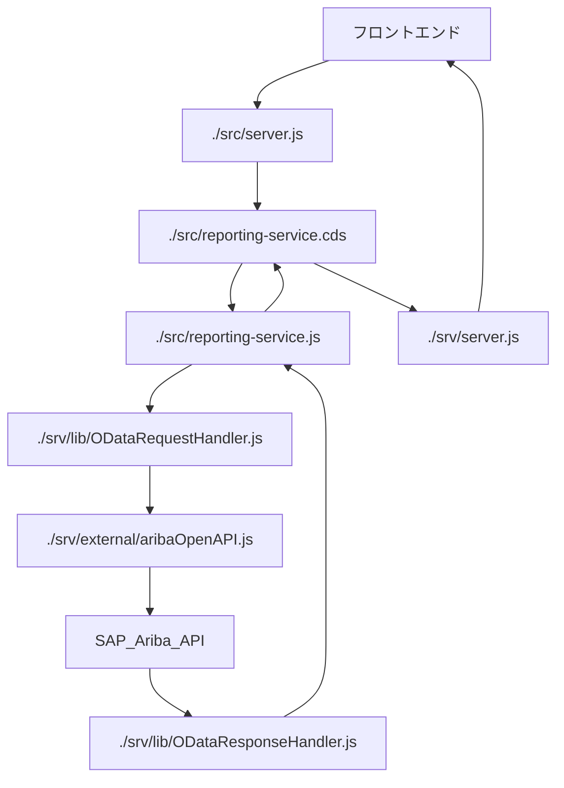

# 本ハンズオンで利用しているアプリケーションコードの実装解説

## 概要

本ハンズオンは、CAP(Cloud Application Programming Model)というSAP独自のWebフレームワークに基づいたアプリケーションを扱います。
処理内容としては、SAP Ariba API により提供される REST API から取得した内容を、ODataもどきに変換し、フロントエンドアプリケーションであるSAPUI5アプリケーションへデータを整形して渡します。

## ディレクトリ構造

このアプリケーションに含まれるファイルと、それぞれの役割は以下のとおりです。

| ディレクトリ | | 内容 |
| ---------------------- | ---- | ------------------------ |
| `./app`               | | UIフロントエンドのソースコード(フロントエンド本体) |
| `./db`                | | アプリ内で利用されるドメインモデルとデータ |
|  | `/data-model.cds` | ドメインモデル |
| `./srv`               | | アプリ内で利用されるサービスモデルとカスタムハンドラ(バックエンド本体) |
|  | `/server.js` | CORS設定をコントロールするミドルウェアを実装 |
|  | `/reporting-service.cds` | サービスモデル |
|  | `/reporting-service.js` | カスタムハンドラ |
|  | `/external/aribaOpenAPI.js` | AribaのAPIを呼び出すカスタムモジュール |
|  | `/lib/designTimeTools.js` | コーディング時に利用するカスタムモジュール |
|  | `/lib/ODataRequestHandler.js` | フロントエンドからのODataクエリをパースするカスタムモジュール |
|  | `/lib/ODataResponseHandler.js` | フロントエンドへのODataレスポンスを$selectや$orderbyにより調整するカスタムモジュール |
| `./xs-security.json`       | | アプリを利用するために必要な権限ロールの設定 |
| `./mta.yaml`           | | Multi Target Application (mta) : BTP上のマイクロサービスを横断・統合したデプロイ設定 |
| `./package.json`       | | プロジェクトのメタデータと設定 |
| `./README.md`          | | 本スタートガイド |

## 個別ファイルの役割の解説

全体の挙動としては、下記のダイアグラムの通りとなります。



<details>

<summary>./mta.yaml</summary>

MTA（Multi Target Application）の設定ファイルです。一部抜粋を記載しており、大枠は以下の通りになっています。
例えば `module -> aribaOpenAPI_proxy-srv` はNode.jsアプリケーションであり、`aribaOpenAPI_proxy-destination`や`aribaOpenAPI_proxy-auth`というマイクロサービスに依存しています。

```yaml
_schema-version: "3.1"                        # Schemaのバージョンを明記することで、mta.yamlのプロセッサとのバージョンを合わせる
ID: aribaOpenAPI_proxy                        # SAP BTP, Cloud Foundry Runtime 上で一意となるIDを付与
description: ariba OpenAPI proxy to OData     # このアプリケーションの説明
version: 1.0.0                                # このアプリケーションのバージョン
modules:                                      # このアプリケーションを構成するモジュール
- name: aribaOpenAPI_proxy-srv                # サービスモジュールの名前
  type: nodejs                                # モジュールのタイプ (Node.js)
  path: gen/srv                               # モジュールのファイルパス
  requires:                                   # このモジュールが依存するリソース
  - name: aribaOpenAPI_proxy-destination
  - name: aribaOpenAPI_proxy-auth
  provides:                                   # このモジュールが提供するリソース
  - name: srv-api
    properties:
      srv-url: ${default-url}                 # プロパティの定義
  parameters:                                 # モジュールに関するパラメータ
    buildpack: nodejs_buildpack               # 使用するビルドパック
  build-parameters:                           # ビルド時のパラメータ
    builder: npm                              # 使用するビルダー (npm)
resources:                                    # アプリケーションが依存するリソース
- name: aribaOpenAPI_proxy-destination        # リソースの名前
  type: org.cloudfoundry.managed-service      # リソースのタイプ (Managed Service)
  parameters:                                 # リソースに関するパラメータ
    config:                                   # リソースの設定
      HTML5Runtime_enabled: true
      init_data:
        instance:
          destinations:
          - Authentication: NoAuthentication
            HTML5.DynamicDestination: true
            HTML5.ForwardAuthToken: true
            Name: aribaOpenAPI_proxy-srv-api
            ProxyType: Internet
            Type: HTTP
            URL: ~{srv-api/srv-url}
          existing_destinations_policy: update
    service: destination                      # 使用するサービス (destination)
    service-plan: lite                        # サービスプラン (lite)
  requires:                                   # このリソースが依存するリソース
  - name: srv-api
- name: aribaOpenAPI_proxy-auth               # リソースの名前
  type: org.cloudfoundry.managed-service      # リソースのタイプ (Managed Service)
  parameters:                                 # リソースに関するパラメータ
    config:                                   # リソースの設定
      tenant-mode: dedicated
      xsappname: aribaOpenAPI_proxy-${org}-${space}
    path: ./xs-security.json
    service: xsuaa                            # 使用するサービス (xsuaa)
    service-plan: application                 # サービスプラン (application)
- name: aribaOpenAPI_proxy-repo-host          # リソースの名前
  type: org.cloudfoundry.managed-service      # リソースのタイプ (Managed Service)
  parameters:                                 # リソースに関するパラメータ
    service: html5-apps-repo                  # 使用するサービス (html5-apps-repo)
    service-name: aribaOpenAPI_proxy-html5-srv
    service-plan: app-host                    # サービスプラン (app-host)
parameters:                                   # アプリケーション全体に関するパラメータ
  deploy_mode: html5-repo                     # デプロイモード (html5-repo)
  enable-parallel-deployments: true           # 並行デプロイを有効にする
build-parameters:                             # ビルド時のパラメータ
  before-all:                                 # 全ビルド前に実行するパラメータ
  - builder: custom                           # 使用するビルダー (カスタム)
    commands:                                 # 実行するコマンド
    - npx cds build --production

```
</details>

<details>
<summary>./srv/server.js</summary>
このファイルでは、ミドルウェアを実装しています。
CORSの制限に引っかかることを簡易的に回避しています。本番環境では適切にCORS許容先のドメイン等を設定する必要があります。

```javascript
"use strict";

const cds = require("@sap/cds"); 
const cors = require("cors");
cds.on("bootstrap", app => app.use(cors()));

module.exports = cds.server;
```

</details>

<details>
<summary>./srv/reporting-service.cds</summary>
SAP Aribaから取得するデータのエンティティとその関連を定義しています。具体的には、購買依頼（C_Requisitions）、購買依頼の承認履歴（C_Requisitions__to_ApprovalRecords）、購買依頼の品目（C_Requisitions__to_LineItems）、請求書（C_Invoices）のエンティティが定義されています。これらのエンティティは読み取り専用であり、それぞれに対してUIアノテーションが付けられています。これにより、各エンティティの表示方法が定義されています。


</details>

<details>
<summary>./srv/reporting-service.js</summary>
カスタムハンドラを定義するファイルです。 `reporting-service.cds` で提供されるエンティティに対する操作（特にREAD操作）が定義されています。このファイルでは、SAP Aribaからデータを取得し、一時的にキャッシュする機能が実装されています。また、クライアントからのリクエストに応じて、キャッシュからデータを取得し、必要に応じてフィルタリングやソートを行い、クライアントに返す機能も実装されています。このファイルでは、キャッシュの有効性を確認し、キャッシュが無効な場合や存在しない場合には新たにデータを取得するロジックが含まれています。
</details>
