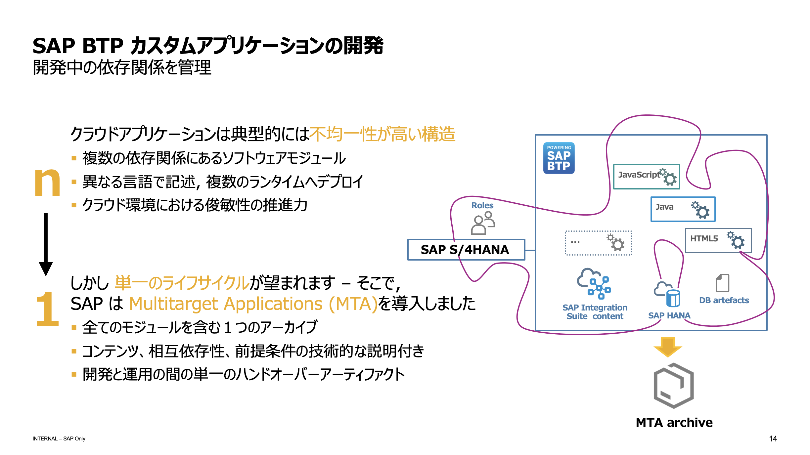
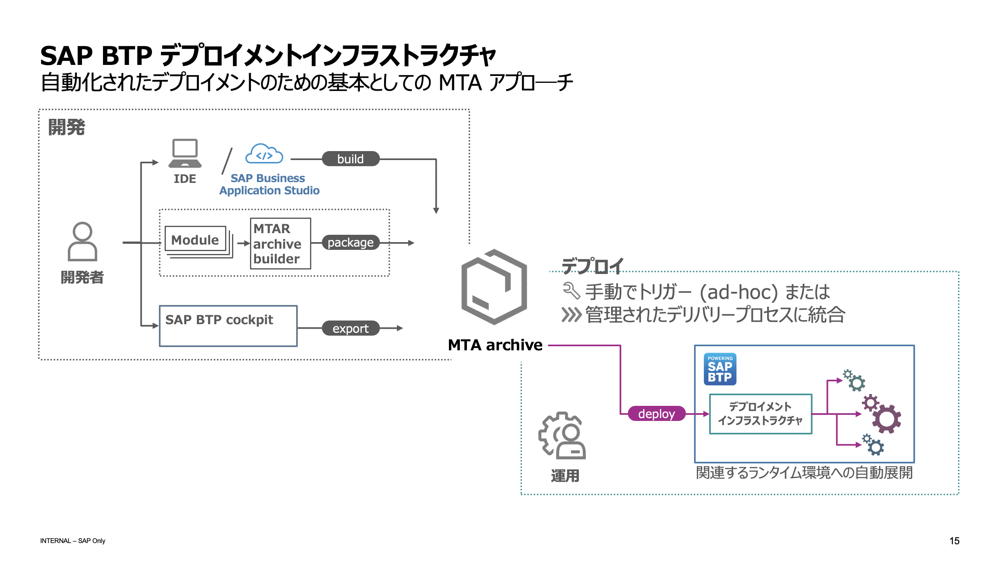

# マルチターゲットアプリケーション（MTA）

## 概要

マルチターゲットアプリケーション（MTA）は、SAP BTP, Cloud Foundry 環境における複数の技術スタックやサービスを統合したアプリケーションを構築・デプロイするためのフレームワークです。
これにより、異なるプラットフォームや技術を使用するコンポーネントを単一のアプリケーションとして管理し、効率的に運用することが可能になります。





## MTAの目的と利点

- **統合管理**: 異なる技術スタックやサービスを一つのアプリケーションとして管理できるため、運用管理が簡素化されます。
- **再利用性**: 各モジュールを独立して開発・テスト・デプロイできるため、再利用性が向上します。
- **スケーラビリティ**: 必要に応じて特定のモジュールをスケールアップまたはスケールダウンでき、リソースの効率的な利用が可能です。

## 技術的な構成

1. **モジュール**: MTAは複数のモジュールから構成されます。例えば、Node.js、Java、Pythonなどのモジュールがあります。各モジュールは独自の技術スタックで開発され、特定の機能を担当します。
2. **mta.yaml**: MTAの設定ファイルであり、各モジュールの定義、依存関係、デプロイメント設定などが記述されています。
3. **サービス**: 各モジュールが必要とするデータベースや認証サービスなどの外部サービスを定義・連携します。

## 開発とデプロイの手順

1. **プロジェクトの作成**: SAP Business Application Studio などの開発環境を使用して、MTAプロジェクトを作成します。
2. **モジュールの追加**: 必要なモジュールをプロジェクトに追加し、mta.yamlファイルに記述します。
3. **ビルド**: MTAアーカイブビルダーを使用して、MTARファイル（デプロイ用アーカイブ）を生成します。
```shell
$ mbt build
```
4. **デプロイ**: Cloud Foundryのcfコマンドを使用して、生成したMTARファイルをデプロイします。
```shell
$ cf deploy target/your_app.mtar
```

## 実際のユースケース
例えば、Node.jsを用いたアプリケーションルーター、Javaのバックエンドサービス、そして認証サービス（XSUAA）を統合するMTAプロジェクトを構築できます。
これにより、異なる技術を組み合わせた複雑なビジネスロジックを実現することができます。MTAを使用することで、開発からデプロイまでの一連のプロセスが統合され、複雑なシステムも効率的に管理できます​。


