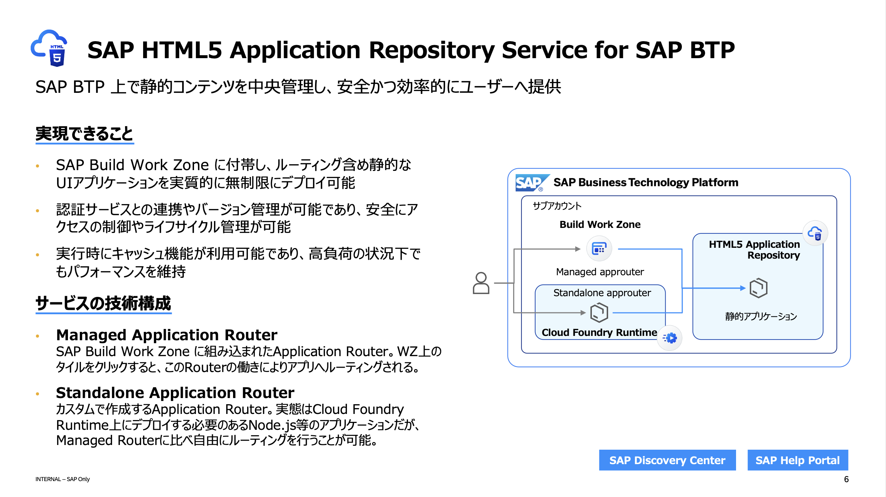

## Managed Approuter とは？

### Managed Approuter
- **SAP Business Technology Platform (BTP)** 上で動作する、フルマネージドのルーティングサービスです。
- アプリケーションの認証、ルーティング、およびセキュリティポリシーの管理を自動化します。
- インフラ管理が SAP によって完全に行われるため、開発者はアプリケーションの開発に集中できます。

> [!NOTE]
> Approuter には「Managed Approuter」と「Standalone Approuter」の2種類があります。 
>  

### Standalone Approuter
- 自己管理型のルーティングコンポーネントで、任意のインフラストラクチャ上で実行可能です。実体はNode.jsのアプリケーションです。
- より高いカスタマイズ性と制御が可能で、独自のセキュリティポリシーを設定することができます。
- 開発者はアプリケーションだけでなく、Approuterの運用および管理にも責任を持つ必要があります。
- Standalone Approuter パッケージのソースコードは下記をご参照ください。
  - [ @sap/approuter | npm ](https://www.npmjs.com/package/@sap/approuter)

## SAP HTML5 Application Repository Service for SAP BTP との関係性

- **SAP HTML5 Application Repository Service for SAP BTP** は、HTML5アプリケーションのストレージおよびデプロイメントを管理するためのWebサーバーサービスです。
- Managed Approuter を利用することで、SAP HTML5 Application Repository Service for SAP BTP に保存されたアプリケーションへのエンドユーザーのアクセスをセキュアに制御できます。
- アプリケーションの配布とアクセス管理がシンプルかつ効率的になり、セキュリティリスクの軽減が可能になります。

## SAP Build Work Zone との関係性

- **SAP Build Work Zone** は、企業内でのコラボレーションとアプリケーションの統合を促進するデジタルワークスペースです。
- SAP Build Work Zone とManaged Approuterには密接な関係があります。
  - **SAP Build Work Zone** からアクセスされるアプリケーションは、**HTML5 Application Repository**にてホストされ、そこへのセキュアなアクセスには **Managed Approuter** が利用されます。
  - エンドユーザーがシームレスにアクセスできるように、複数のバックエンドサービスやアプリケーションとの間でルーティングと認証を行います。

