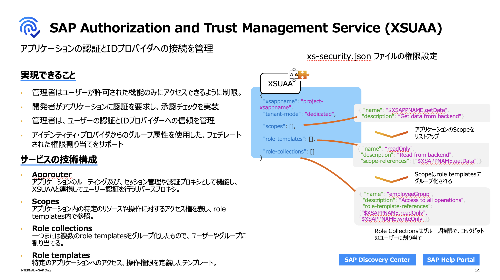
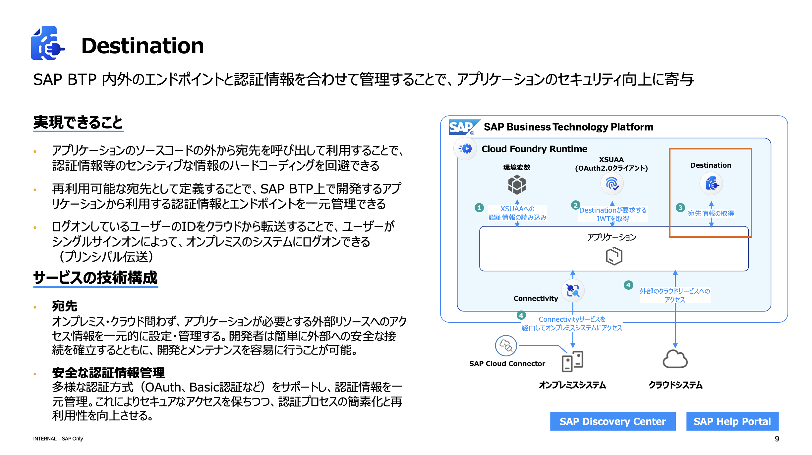

## XSUAAサービス (XS Advanced User Authentication and Authorization)

### 概要
- **XSUAA** は、SAP BTP上でアプリケーションのセキュリティを管理するためのサービスです。
- 認証と承認の機能を提供し、セキュリティトークンサービスとして機能します。

### 主要機能
- **ユーザー認証**: ユーザーの身元を確認するプロセス。
- **クライアント認証**: アプリケーションが自身を認証するための仕組み。
- **ロールベースのアクセス制御**: ユーザーに割り当てられたロールに基づいてリソースへのアクセスを管理します。

### 利用シナリオ
- **マイクロサービスセキュリティ**: 各マイクロサービス間の認証および承認を管理。
- **エンタープライズアプリケーション**: 大規模なビジネスアプリケーションにおいてユーザー認証およびアクセス管理を強化。

## Destinationサービス

### 概要
- **Destinationサービス** は、SAP BTP上で外部システムへの接続設定を管理するためのサービスです。
- アプリケーションが外部システムへの接続情報を一元管理できるように支援します。

### 主要機能
- **接続設定の管理**: 接続先のURL、認証情報などを含む接続設定を一元管理。
- **セキュアなストレージ**: 認証情報などのセキュリティが必要な情報を安全に保管。

### 利用シナリオ
- **外部APIの統合**: SAP BTP上のアプリケーションから外部のAPIに接続するための情報を提供。
- **クラウドとオンプレミスの統合**: クラウドベースのアプリケーションがオンプレミスシステムへ安全に接続するためのゲートウェイとして機能。

