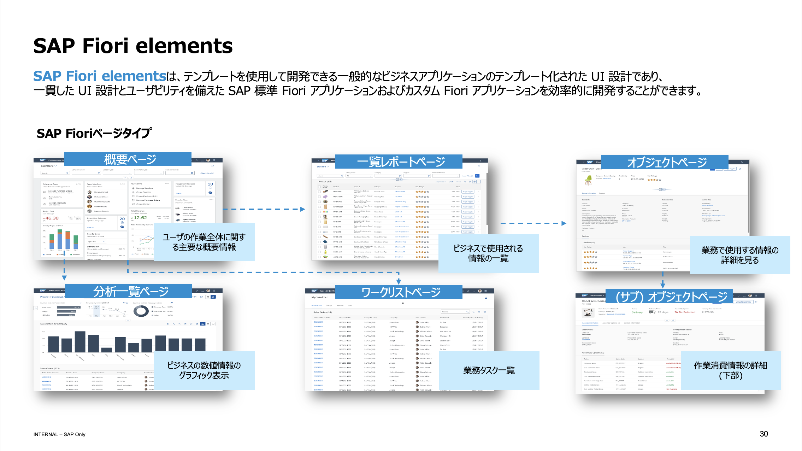

# SAP Fiori の概要

## デザイン原則
SAP Fioriは、使いやすさを重視したデザインが特徴であり、以下の原則に基づいています。
- ロールベース
- レスポンシブ
- シンプル
- 一貫性
- コヒーレント

## 技術的枠組み
SAP Fioriは、HTML5、CSS3、JavaScriptに基づくフレームワークである**SAPUI5**（または**OpenUI5**）を使用しています。これにより、洗練されたユーザーインタフェースの構築が可能です。 
 

## アーキテクチャ
SAP Fiori アプリケーションは主に以下の三層で構成されています：
1. **プレゼンテーション層**：HTML5とSAPUI5を使用してUIがブラウザ上でレンダリングされます。
2. **アプリケーション層**：SAP NetWeaver Gatewayを通じてODataプロトコルを用いたデータ交換が行われます。
3. **データベース層**：SAP HANAなどのデータベースにアクセスします。

## フロントエンドとバックエンドの開発
- **フロントエンド**：SAPUI5を使用し、クライアントサイドでHTML、CSS、JavaScriptによるUIが構築されます。
- **バックエンド**：
  - **ABAP**: SAPのサーバー上で実行されるアプリケーションロジックとデータベースとのやり取りが行われます。SAP NetWeaver Gatewayを通じてABAPでODataサービスが開発されます。
  - **SAP BTP**: SAP Business Technology Platform 上でSAP Cloud Application Programming Model (CAP) を使用した開発が行われます。CAPは、Node.jsやJavaでのアプリケーションをサポートし、SAP Fioriと組み合わせてエンドツーエンドのソリューションを提供します。

## 進化
SAP Fioriは、初期のバージョンから進化を遂げ、現在ではSAP S/4HANAの主要なユーザーインターフェースとして機能し、クラウドサービスとしても提供されています。

## Fiori Elements

Fiori Elementsは、効率的なアプリケーション開発をサポートするフレームワークの一部で、デベロッパーが一貫性と高品質なユーザーインターフェースを容易に構築できるように設計されています。このフレームワークは、プリビルトのテンプレートとガイドラインを提供し、コーディングの必要性を最小限に抑え、開発プロセスを加速します。

### 主な特徴
- **テンプレートベースのアプローチ**: Fiori Elementsは、リスト、オブジェクトページ、概要ページなど、複数のテンプレートを提供しており、これらのテンプレートを使用して一貫した外観と機能を持つアプリケーションを迅速に構築できます。
- **アノテーション駆動**: データモデルに対するアノテーションを使用してUIの動作を定義することで、開発者はビジネスロジックに集中でき、UIの詳細なコーディングから解放されます。
- **自動UI生成**: アノテーションとテンプレートに基づいて、Fiori Elementsは必要なUIを自動的に生成し、一貫性とユーザビリティの高いインターフェースを保証します。

### 利点
- **開発時間の短縮**: UI開発における手作業の必要性が減少するため、プロジェクトのタイムラインが短縮されます。
- **コスト削減**: 一貫したテンプレートを使用することで、開発およびメンテナンスコストが削減されます。
- **ユーザーエクスペリエンスの向上**: SAPのデザインガイドラインに従ったプリビルトのテンプレートを使用することで、最終的なアプリケーションはユーザーフレンドリーで直感的な操作性を持ちます。

