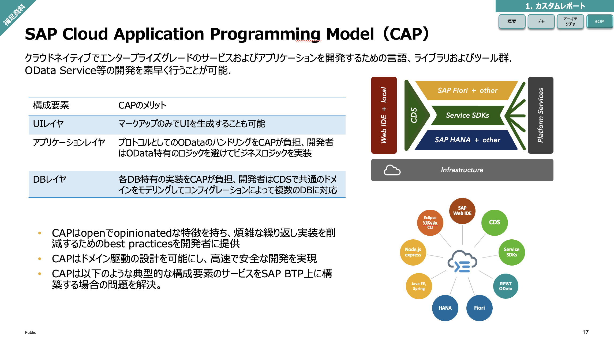

## SAP CAP（Cloud Application Programming Model）

### 主な構成要素

- UIレイヤ
    - **アノテーション**: バックエンド側でデータモデルにUI情報を付加することで、FioriのUIがフロントエンドで自動生成
- アプリケーションレイヤ
    - **Service Definition**: CAPがODataサービス層を定義して提供、APIを通じて外部に公開可能
    - **Service Implementation**: 実際のビジネスロジックを実装
- DBレイヤ
    - **CDL(Definition Language)**: 人間に読みやすい形で、データモデルを定義




### CAPアプリケーションの基本的なディレクトリ構造

```tree
.
└── my-cap-project/              ルートディレクトリ
    ├── app                      フロントエンドのファイル群を入れる
    ├── db/                      データモデルやモックデータのファイル群を入れる
    │   └── schema.cds              データモデル定義
    ├── srv/                     サービスの定義ファイル群を入れる
    │   ├── cat-service.cds         ODataサービスの定義
    │   └── cat-service.js          ODataサービスのカスタムロジックなどを定義
    └── package.json             依存関係や各種設定事項を記入
```

### シンプルなCAPアプリケーションの例
- 「Books」というエンティティを定義し、読み取り、登録、更新、削除 (CRUD) 全ての操作を許可して外部に公開する。
- 登録時には「Books」のタイトルが少なくとも2文字以上でなければならない、というバリデーション(入力値チェック)をかける。

    - データモデルの定義 (db/schema.cds):
    ```cds
    namespace my.company;
    entity Books {
        key ID : Integer;
        title : String;
        author : String;
    }
    ```

    - サービス定義 (srv/cat-service.cds):
    ```cds
    using my.company from '../db/schema';
    service CatalogService {
        entity Books as projection on my.company.Books;
    }
    ```

    - サービス実装 (srv/cat-service.js):
    ```js
    const cds = require('@sap/cds');

    module.exports = (srv) => {
        // カスタムハンドラの定義

        // 「Books」エンティティの読み込み
        const { Books } = cds.entities;
        
        // 「Books」に対してのデータ登録操作を行う前に発火
        srv.before('CREATE', 'Books', (req) => {
            // ビジネスロジックをここに追加
            if (req.data.title.length < 2) {
                throw new Error('Title must be at least 2 characters long');
            }
        });

        // 「Books」に対してのデータ読み取り操作を行う時に発火
        srv.on('READ', 'Books', async (req) => {
            return cds.tx(req).run(SELECT.from(Books));
        });
    };
    ```