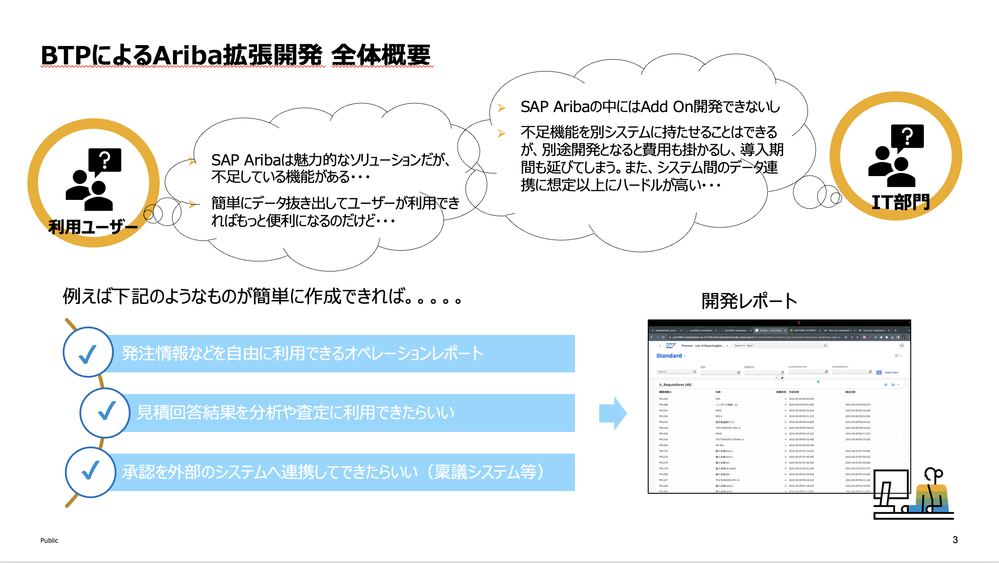
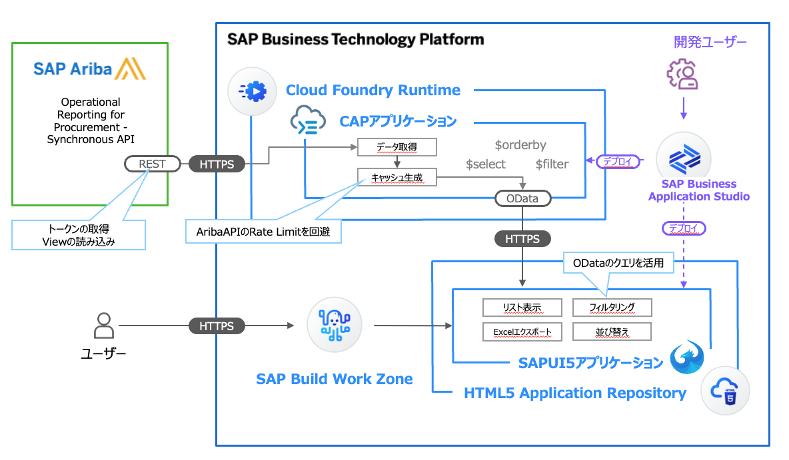

# SAP Ariba x SAP BTP による Side-by-Side拡張 ハンズオン

## はじめに
このドキュメントでは、SAP AribaとSAP Business Technology Platform (BTP) を用いたSide-by-Side拡張のハンズオンについて解説を行います。

> [!WARNING]
> 免責事項  
> 教育目的のみの使用: 本コンテンツは教育目的のみに提供されます。商業的利用や他の目的での使用は禁止されています。 
> 正確性の保証の否認: 本コンテンツの作成には細心の注意を払っておりますが、情報の正確性や完全性を保証するものではありません。本コンテンツを使用することによって発生した直接的または間接的な損害について、当方は一切の責任を負いません。 
> 結果の保証の否認: 本コンテンツを使用したことによる学習効果やその他の成果に関して、いかなる保証も行いません。 
> 第三者のリンク: 本コンテンツには外部の第三者が提供する情報へのリンクが含まれる場合がありますが、これらのサイトの内容について当方は責任を負いません。 
> 知的財産権: 本コンテンツに含まれる情報、ロゴ、画像などは法的に保護されており、無断での複製、配布、公開は禁じられています。 
> 利用条件の変更: 当方は予告なしに本免責事項を変更する権利を有します。本ページの利用条件が変更された場合、利用者は変更された条件に拘束されるものとします。 
> 本コンテンツを利用することにより、利用者は上記の免責事項に同意したものとみなします。 

## 拡張開発シナリオ 概要

**ユーザーの抱える課題**
1. Excel 形式で SAP Ariba のデータを抽出し、他のシステムに連携したい
2. SAP S/4HANA Cloud と親和性の高い Fiori UI を用いて、SAP Ariba に蓄積されたデータを確認したい

**上記課題に対する解決策**
* SAP Ariba に用意された Operational Reporting API を用いてデータを抽出します
* SAP BTP 上で、データを適切に処理するバックエンドアプリケーションを構築します
* 高度に自動化されたフロントエンド開発ツールを用いて、SAP S/4HANA Cloud の標準UIである Firoi でカスタムUIを構築します

## 本ハンズオンの流れ
本ハンズオンは、以下のステップに従って進行します。
1. [開発環境のセットアップ](./01_マニュアル/01_開発環境のセットアップ/README.md)
2. [バックエンドアプリの構築](./01_マニュアル/02_バックエンドアプリの構築/README.md)
3. [フロントエンドアプリの構築](./01_マニュアル/03_フロントエンドアプリの構築/README.md)
4. [デプロイと結果の確認](./01_マニュアル/04_デプロイと結果の確認/README.md)

## 実装アーキテクチャ
本ハンズオンは以下のアーキテクチャでの実装を行います。
主要なコンポーネントは以下の3つです。

1. SAP Ariba：データソース
2. バックエンドCAPアプリケーション：SAP AribaのAPIからデータを取得し、フロントエンドへのデータの伝播と、フィルタリングや並び替え等の諸機能を提供する
3. フロントエンドSAPUI5アプリケーション：ユーザーの目にふれるFiori UIを提供するアプリケーション

## 本リポジトリのディレクトリ構成

| ディレクトリ     |  内容                        |
| -------------- |-------------------------- |
| `00_Assets`    | 管理用: README 素材ディレクトリ|
| `01_マニュアル`  |  本ハンズオンで利用するマニュアル |
| `02_ソースコード` | ソースコード                 |
| `./README.md`  |  本スタートガイド             |

## 次のステップ

[1. 開発環境のセットアップ](../01_開発環境のセットアップ/README.md)  

### 各ステップ リンク一覧
[1. 開発環境のセットアップ](../01_開発環境のセットアップ/README.md)  
[2. バックエンドアプリの構築](../02_バックエンドアプリの構築/README.md)  
[3. フロントエンドアプリの構築](../03_フロントエンドアプリの構築/README.md)  
[4. デプロイと結果の確認](../04_デプロイと結果の確認/README.md)  

## 終わりに
このハンズオンを通じて、SAP AribaとSAP BTPを活用した拡張開発の基本を理解し、実際のプロジェクトに応用できる知識と経験を得ることができます。

## さらなる深みへ！ 参考文献のご紹介
| サイト名        |   URL   |
| -------------- | ------- |
| CAP 公式ドキュメント: CAPire | https://cap.cloud.sap/docs/get-started/hello-world |